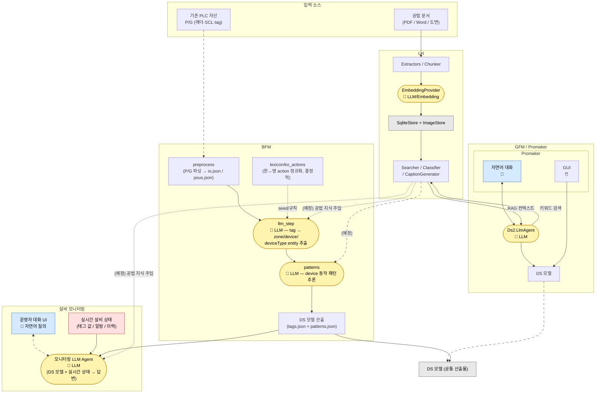

# 전체 솔루션 개념도 (GFM · BFM · LH · 설비 모니터링)

### 용어
- GFM: Green field modeling.  아무것도 없는 상태 또는 기존 DS 모델상에서 모델링
- BFM: Brown field modeling.  PLC P/G 으로부터 reverse engineering 을 통한 모델링
- LH : Light house.  문서로부터 색인하여 Knowledge-base 구축

## 범례 (Legend)

<table>
  <thead>
    <tr><th>표기</th><th>의미</th></tr>
  </thead>
  <tbody>
    <tr>
      <td>━━━━ &nbsp;실선</td>
      <td>본류 / 구현된 데이터·제어 흐름</td>
    </tr>
    <tr>
      <td>╌ ╌ ╌ &nbsp;점선</td>
      <td>보조 흐름, 또는 <code>(예정)</code> 라벨이 붙은 미구현 연결</td>
    </tr>
    <tr>
      <td> 🤖 노란 노드</td>
      <td>LLM / Embedding 사용 지점</td>
    </tr>
    <tr>
      <td> 💬 파란 노드</td>
      <td>자연어 입력 (대화) 진입 지점</td>
    </tr>
    <tr>
      <td> 빨간 노드</td>
      <td>실시간 운영 데이터</td>
    </tr>
    <tr>
      <td> 회색 노드</td>
      <td>저장소 / 산출물</td>
    </tr>
  </tbody>
</table>

