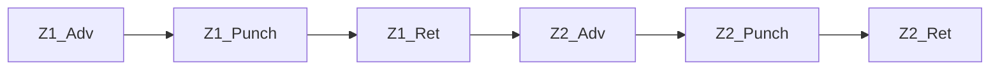

# Promaker LLM ↔ MCP — YAML 기반 프로토콜 설계 (v0)

> 본 문서는 *코드 변경 전* schema 확정 단계의 설계 문서입니다 (`--plan` 정신).
> 후속 PR 에서 PoC 구현 / 마이그레이션 / 기존 op-layer 도구 정리가 단계적으로 이어집니다.

---

## 1. 배경 — 왜 protocol 을 갈아엎는가

### 1.1 현재 흐름의 관찰

사용자가 자연어로 사양을 주면 LLM 이 entity 단위 mutation op 으로 분해하여 MCP 에 전송, MCP 가 Promaker 모델을 구축합니다. 실제 로그 (`ds2.log20260512` turn #2) 에서 관찰된 한 turn 의 모습:

| 항목 | 값 |
|---|---|
| 자연어 사양 | "Part 가 구역1/2/3 순차 이동, 각 구역 cylinder N개 동시 전진 후 Pusher Punch 후 동시 후진" |
| LLM 분해 결과 | 62 op (`apply_operations` batch) |
| API duration | 124 초 |
| Output tokens | 15,013 |
| Thinking signature | 13~21 KB |
| 재시도 round-trip | 1회 발생 (`BATCH_ERROR: args.apiNames 가 array 가 아닙니다 (ValueKind=String)`) |
| 비용 | $0.61 / turn |

### 1.2 문제 — LLM 책임이 너무 낮은 layer 에 묶여 있다

LLM 이 *자기 머리로* 처리해야 하는 일:

1. **entity 분해** — Station/Zone/Punch → Active System / Flow / Work / Call / Arrow / ApiDef 그래프 변환
2. **GUID chaining** — `add_work` 결과 GUID 를 `add_call(workId=GUID)` 로 전달
3. **batch ref 메커니즘** — `@cyl`, `@advW` 같은 sub-ref 정의 / 참조 순서
4. **cascade 규칙** — Passive 의 Flow + Work×N + ApiDef×N + ResetReset Arrow canonical
5. **quota 사전 산식** — `cascadeOpCount(N, opposing) = 3 + 2N + …` 자가 계산, 1600 임계 분할
6. **arrow 위상** — Start / Reset / StartReset / ResetReset / Group / Unspecified 결정
7. **read-vs-mutation 시점** — *같은 turn 안 read 는 mutation 반영 안 됨* 등 운영 규칙

→ prompt 가 *도구 30+ 정의 + 운영 규칙 + cascade 룰 + quota 산식* 으로 비대해지고, 매 turn thinking 으로 이 전부를 다시 reconstitute 해야 합니다. 비용·지연·재시도 빈도의 근본 원인.

### 1.3 잘못된 추상화 경계

현재 MCP layer 구조:

| 추상화 | 도구 예 | LLM 부담 |
|---|---|---|
| Pattern / Scenario | (없음) | LLM 이 매번 분해 |
| Station / Group | (없음) | LLM 이 매번 분해 |
| Device (1개) | `add_cylinder` / `add_robot` / `add_device` | 적정 |
| Entity primitive | `add_work` / `add_call` / `add_arrow` … | escape hatch 여야 할 도구가 *주력으로 사용 중* |

MCP 가 **DB schema CRUD primitive** 레벨에 머물러 있어, 자연어의 가장 흔한 단위 (Station, Zone, PartFlow) 가 *없음* — 분해 노동이 매 turn 반복됩니다.

### 1.4 검토한 대안 — helper layer 보강 (반려)

처음 검토한 방향: `add_station`, `add_part_flow` 같은 *더 큰 도메인 helper* 를 MCP 에 추가. 사용자 검토 결과 **반려** — 이유:

- helper 의 orchestration enum 이 사양 다양성을 다 흡수하지 못하면 escape hatch (primitive) 의존이 도리어 커짐
- helper / primitive 혼용 시 정합 깨질 위험
- **추상화 경계가 여전히 MCP 안에 있어, LLM 의 layer 부담 자체는 줄지 않음**

### 1.5 채택 방향 — *layer 자체를 뒤집는다*

LLM 의 강점과 약점을 다시 정리:

|  | LLM | MCP (F# 코드) |
|---|---|---|
| **잘하는 일** | 자연어 → 구조화된 표현 변환, 도메인 어휘 해석, 사양 모호성 해결 | 정확한 트랜잭션, 검증, cascade, GUID 관리 |
| **못하는 일** | 정확한 GUID chaining, 정밀 카운트, op 순서 일관성 | 자연어 이해 0 |

현재 layer 는 *정확히 거꾸로* 위임하고 있습니다. **LLM 에게 graph 구축을, MCP 에게 자연어를 안 시킬** 뿐, 가운데의 *graph 변환* 책임을 LLM 이 떠안고 있는 셈.

**올바른 분리**:

- **LLM 책임** = 자연어 → **구조화된 선언적 문서**
- **MCP 책임** = 문서 → entity graph 변환 + 검증 + cascade + 트랜잭션

문서의 *형식* 은 두 갈래로 나뉩니다 — 자세한 결정 배경은 §8 부록 참조:

- **Wire format (LLM ↔ MCP 통신)** = JSON object — tool_use input 의 native form, escape 0, LLM 정확도 최상.
- **Presentation format (사람 시야 / 디스크 SSOT / git diff)** = YAML — 들여쓰기 시각화, 주석 가능, diff 친화.

두 포맷의 *schema 는 1:1 동형* (키 이름·중첩 동일) — YamlDotNet round-trip 변환으로 자유 전환. 본 v0 문서의 §2~§3 예시는 *YAML 표기* 로 보여드리지만, 실제 wire 의 JSON 도 동일 구조입니다.

### 1.6 YAML doc-level protocol 의 이점

| 측면 | 현재 (op-level) | YAML doc-level |
|---|---|---|
| LLM 책임 | 사양 분해 + entity 분해 + GUID + cascade + quota + ref 순서 | **사양 → YAML 변환만** |
| MCP 책임 | primitive CRUD 21개 도구 | **YAML processor 1개** (cascade 룰 응축) |
| 도메인 룰 위치 | LLM prompt / helper / ToolOperations 분산 | **MCP 한 곳에 응축** (SSOT) |
| 사양 SSOT | 자연어 채팅 → 휘발 | **YAML 이 디스크 SSOT** (diff / PR / revert) |
| Round-trip | N + 재시도 위험 | 1 (validate + apply) |
| Prompt token | 도구 정의 + cascade + quota + 에러 매뉴얼 | **schema 한 장** |
| 사용자 직접 편집 | 불가 | **가능** — LLM 우회 / 검토 / 수동 보정 |
| Export 대칭 | impossible | **모델 → YAML export 자연** (round-trip 가능) |
| GUID | LLM 이 chaining 책임 | **LLM 에 노출 안 됨** |

### 1.7 결정 사항 요약 (그 배경)

| 결정 | 배경 |
|---|---|
| **Wire = JSON object / View = YAML** | tool_use input 이 원래 JSON 이라 YAML 을 string field 에 넣으면 이중 escape 비용 (token 낭비 + LLM 출력 안정성 ↓). LLM 통신은 JSON object 직접 전달, 사용자 노출·디스크 저장은 YAML 렌더. 두 포맷 schema 동형. **§8 부록 상세** |
| **GUID 완전 추상화** | LLM 부담의 큰 비중. 이름 기반 참조 + Promaker 의 unique-name 룰이 이를 자연히 가능케 함 |
| **이름 기반 dotted-path** | 모호성 0 우선 (사용자 결정). LLM 부정확은 prompt 지침 + validate 에러 메시지 (가까운 후보) 로 커버 |
| **entity 이름에 `.` 금지** | path 구분자 `.` 와 충돌 회피. `sanitizeName` 에 `.` 거부 추가 (Phase 1 작업). 기존 코드 베이스의 이름들 검토 / rename 필요할 수 있음 |
| **Patch add+remove 룰** | 같은 patch 안 *원래 있던 것 제거 + 신규 추가* 는 자유. *방금 추가한 것 즉시 제거* 는 미지원 (자기 모순). 현재 `queueRemoveEntity` 가 그대로 보장 |
| **Project 키 자동 처리 (mode 인자 폐기)** | LLM 이 store 상태 인지하여 `project:` 키 생략·동일 이름 사용으로 자연 merge. 사용자가 새 project 명시하면 LLM 이 GUI 닫기 안내. MCP 는 시나리오별 자동 처리 (§4 표 참조). 별도 `mode` 인자 없음 |
| **Arrow 옵션 A `A -> B : Type`** | arrowType 6종 명시성 우선. ASCII art 인코딩 (옵션 B) 은 LLM 정확도 ↓ |
| **device F# DU literal** | known 3종 (cylinder/clamp/robot, F# helper 매핑) + custom 확장성을 *동일 표기* 로 통합. `device: custom(WedgeClamp)` 가 valid YAML scalar 로 자연 표현 |
| **`kind:` 명시 강제** | 사용자 검토/편집 시 한눈에 보이도록. 추론 정책은 명시성과 trade-off — 명시성 우선 |
| **ApiDef 중복 Call — 그대로 허용 (alias/#index 폐기)** | 같은 Work 안 같은 ApiDef 가 N회 Call 가능 — concurrent 의 자연 표현. **alias / `#index` 표기 폐기** (단순성 우선). Arrow source/target 으로 중복 이름 참조 시만 validate 에러 (concurrent OK, 순차 chain 은 중복 불가). 코드: `hasCallNameClash` 함수 *자체는 그대로 유지* (기존 op-layer 회귀 차단). **신규 entry `queueAddCallAllowDup`** 추가하여 YAML dispatcher 의 *concurrent path* 에서만 호출 (Phase 1 작업) |
| **새 도구 명명 = `Doc` 접미사** | 기존 `ValidateModel` (consistency check) 과 충돌 회피. 신 도구는 `ApplyModelDoc` / `ValidateModelDoc` / `ExportModelDoc` 으로 차별화 |
| **Known device sugar = 3종 한정** | `cylinder` / `clamp` / `robot` 만 단축형 (`queueAddCylinder/Clamp/Robot` 매핑). 그 외 (pusher / conveyor / agv / gripper / lifter / crane 등) 모두 `custom(<Type>) + apis: [...]` long-form |
| **opposing default 그대로** | known device 의 GUI canonical 형상과 정합 보존 (cylinder/clamp=chain, robot=none). custom 의 default 는 `none` |
| **patch DSL v0 포함** | 점진 mutation 도 GUID 없는 이름 기반 path 로 표현 가능. 별도 v0.1 분리는 분할 비용 > 이익 |
| **`workDuration` 키 통일** | Active Work duration override 와 Passive device duration 동일 의미·동일 type → 단일 키 `workDuration: <duration>`. 옛 `duration:` 표기 폐기 |
| **Call 참조는 systemName 사용 — alias 무시** | Promaker 내부 모델의 `Call.DevicesAlias` (GUI 사용자가 부여한 약어) 는 doc-level 추상화에서 *무시*. doc 표기 `calls: [Cyl1.ADV]` 의 `Cyl1` 은 **Passive system 이름**. 이유: ① LLM 부담 최소화 (alias 별도 개념 불필요) ② doc round-trip 시 alias→systemName 정정으로 단일 표기 보장. **결과**: GUI 가 alias≠systemName 으로 저장한 store 를 export 시 systemName 으로 정정 emit (alias 정보 손실). 의미적 동등은 보존 — ApiDef 식별이 정확. **구현**: `exportToJson` 의 calls emit 에서 `c.DevicesAlias` 대신 `ApiDef.ParentSystem.Name` 사용 (Phase 2 작업). dispatcher (apply) 는 변경 없음 — 이미 systemName 기준 resolve. 데이터 무결성 깨진 store (ApiCall 빈/ApiDefId None/orphan ApiDef·System) 에 도달 시 `c.DevicesAlias` fallback + log4net `WARN` 으로 forensic 단서 (Phase 2 cycle3 외부 review M2 반영) |
| **`custom(Unknown)` fallback (Passive SystemType=None)** | 비정상 store — Passive system 인데 `SystemType` 가 `None` 인 경우. export 는 `device: custom(Unknown), apis: [...]` long-form 으로 fail-safe emit + log4net `WARN`. **주의**: 이 export 결과를 다시 apply 하면 dispatcher 가 `Custom "Unknown"` → `SystemType = Some "Unknown"` 으로 굳음 (silent type mutation). 정상 GUI/helper 흐름은 SystemType ≠ None 보장 → 도달 가능성 0 가까움. 도달 시 logger forensic 단서 + 사용자 인지로 대응 (Phase 2 cycle3 외부 review M1 반영) |
| **`inferOpposing` N=2 정규화 = chain** | Passive internal Flow 의 apiCount=2 + ResetReset=1 케이스에서 *chain* 과 *all-pairs* 가 동일 (둘 다 1 arrow). 정규화 정책: **chain** 으로 분류 (`inferOpposing` 의 `apiCount - 1` 분기가 `all-pairs` 분기보다 먼저 매칭). 의미: cylinder/clamp 등 N=2 sugar 의 default opposing 과 정합 — export 결과 키 생략 (Phase 2 cycle3 외부 review L4 반영) |
| **read surface GUID-free 정렬 (Phase 6)** | Phase 5 mutation 일소 후 잔존 read 6종 중 4종이 GUID 입출력 → done §6 #5 "GUID 는 LLM 에 절대 노출 금지" invariant 와 직접 충돌. `list_projects` / `list_systems` / `describe_system` / `describe_subtree` 4종을 `export_model_doc` 의 `path` / `depth` 인자로 흡수. `find_by_name` 출력 GUID → path. `validate_model` 의 GUID scope + 'global' literal 입력 폐기. LLM 노출 풀세트 10 → 6종 (-40%). 본 Phase 의 SSOT 영향 = §2.1 top-level 키 enum +1 (`view`) / §2.5.1 path resolver 절 신설 / §2.7 룰 #7,#8 신설 / §2.8 partial export view-only spec 신설 / §4 도구 시그니처 갱신. 작업 SSOT = `Apps/Promaker/Docs/done-read-surface-guid-cleanup.md` (closure 5건 + 부속 1건 v4 결정 완료) |
| **`export_model_doc` 인자 = `path?` / `depth?` (Phase 6)** | 기존 `scope: "project" \| "system:<name>"` enum 폐기. `path?: string` (dotted-path, 미지정 = 전체) + `depth?: int ≥ 0` (미지정 = 무한) 로 표현력 ↑. GUID 0건. partial export 결과는 `view: partial` flag + view-only (apply/validate 재입력 거부). 판정 = `exportToJson` walk 안 `truncated: bool ref` (실제 절단 발생 시에만 partial). depth schema 사전 거부 (음수/비정수). |
| **Path resolver `tryFindEntity` (Phase 6)** | thin lookup `DsStore → string → (EntityKind * Guid) option`. **kind 인자 없음** — path 깊이 (`proj/system/flow/work/call` = 1~5 segment) 로 EntityKind 자동 결정. ApiDef vs Flow ambiguity (둘 다 System 직접 자식, 3-segment) 는 내부 lookup 순서 (ApiDef → Flow → None). Arrow path-addressable 아님 (출력 EntityKind 후보에 포함 안 됨). 신규 역방향 helper `pathOf` (find_by_name 출력 emit). 기존 `findSystemByName` / `findFlowByPath` 호출지점 그대로 유지 — 신규 resolver 는 신규 진입점 (export.path / validate_model.scope / find_by_name) 에만. 사용자 철학 (기존 코드 베이스 수정 최소화) 정합 |
| **`find_by_name` 출력 = `[(kind, path)]` 목록 (Phase 6)** | unique path 강제 4-way (ordinal suffix / GUID tail / sibling invariant / sanitize) 의사결정 항목 자체 폐기. 자연어 이름 → 위치 목록 회신이 본질 — 동명 sibling 도 그대로 N건 노출. cross-kind 동명 (예: System "Run" + Flow "Run") 은 출력의 `kind` 필드로 자연 disambiguation. `findByName : (EntityKind * Guid * string) seq` → `(EntityKind * string) seq` (Guid 제거, path 추가) |
| **`validate_model` scope = path / 미지정 (Phase 6)** | GUID scope 분기 + 'global' literal 입력 폐기. `scope?: string` (미지정 = 전체, path 명시 시 sub-tree). `LlmTurnContext` 의 cache key sentinel = `""` (empty path) 명문화. 출력 footer "(scope=global)" 같은 user-facing 한국어 표기는 가독성 유지 차원 그대로 (wire 입력에만 영향) |
| **`view` flag 정책 (Phase 6)** | export 결과 = 항상 `view: full` 또는 `view: partial` 명시. apply / validate 입력 = `view: partial` 거부 / `view: full` 허용 (자기 round-trip 시나리오) / 부재도 허용 (사용자 직접 작성 YAML / legacy 호환). `view: <other>` ERROR. partial 결과는 view-only — apply/validate 재입력 거부 (alias fallback / cross-system arrow 의 misleading 회귀 차단) |
| **Path notation = dot 정규형 + leading `.` 절대 경로 (Phase 6 부속)** | wire 입력 dual-accept (`.` / `/` 모두 OK — 기존 `normalizePath` 동작 유지, 변경 0). 정규형 = dot. **root 절대 경로 = leading `.`** 권장 어휘 (예: `.Proj1.SysA.Flow1`). leading `.` 은 어휘 강조 prefix 일 뿐 segment 카운트에 영향 없음 (`TrimStart('.')` 진입 시 적용). 이름의 `.` 금지 invariant 유지 (변경 0) — leading `.` 와 이름 충돌 0건 |
| **export 완결성 4분류 (Phase 7 §4.1)** | export 항목을 4분류로 정리 — **必** (모델 의미 기여, 보강 필수) / **派** (도출 가능, 보강 불필요) / **意** (의도된 lossy 4-set = GUID·position·alias·시뮬결과) / **メ** (PLC 코드 생성 메타데이터, 사용자 명시 설정 부분만 必 격상). 본 분류는 *우선순위 라벨 (高/中/低)* 와 직교 — 必 항목만 우선순위 적용. boundary handling sub-rule: ① fallback 으로 보존되는 派 의 forensic 단서는 의미 분류 의 意 우선 유지 (`Call.DevicesAlias` alias-fallback) ② PoC 가정 의존 도출 (`workDuration "첫 work 만 대표"`) 은 必 격상 ③ runtime-only / 단순 cache 는 派 ④ 4-set 명시 lossy 는 意 ⑤ PLC 코드 생성 메타는 メ — 사용자 명시 설정만 必 |
| **Call object dual format (Phase 7 §4.1.5 — 옵션 C 채택)** | `calls:` 배열 element 표기를 **default 시 string scalar 유지 / non-default 시 object 승격** 의 dual format 으로 결정. `calls: [Z1_C1.ADV, ...]` 형태는 *모든 보강 property 가 entity-default* 일 때 그대로 보존 (legacy .yaml 호환 100%). 하나라도 non-default (`contactKind` / `skipInputSensor` / `callType` / `callCondition` / `inTag` / `outTag` 등) 가 있을 때만 `- ref: <System>.<ApiDef>` + 추가 키 형태의 object 로 승격. 사유: 기존 schema 무변경 (wire breaking 0) + apply 측 dispatcher 분기 1건 추가만 필요 + LLM 부담 0 증가 (default case 는 기존 string 그대로) + §6.3 (b) "default 생략 emit" 정책 완벽 정합. 대안 (옵션 A — object 강제 / 옵션 B — sibling 키 신설) 모두 호환성 또는 ApiDef 중복 호출 식별 불가 문제로 기각 |
| **SSOT 갱신 책임 표 — §6.1 매핑 (Phase 7)** | export 보강 작업은 SSOT 의 *여러 절 동시 갱신* 강제. todo 변경 항목 ↔ SSOT 절을 1:1 매핑하는 책임 표를 todo §6.1 에 명세. 매핑 표 9 row 모두 갱신 전에는 commit 금지 — 자가 검열 trigger ⑤ (SSOT 상수 갱신) 정합. 본 §1.7 row 자체도 매핑 표의 "전체 → §1.7" row 산출물 |
| **Read level + modeling-level patch merge (Phase 7 §10.2 #31)** | `export_model_doc.level: "full" \| "modeling"` 인자 + apply 측 wire `level:` 키 self-tagged dispatch 도입. 분류 SSOT = `Ds2.LlmAgent.Internal.ModelingCategory` 모듈의 4 카테고리 (A_Modeling / B_Addressing / C_Meta / D_Plc). **A_Modeling**: TokenRole / ContactKind / SkipInputSensor / CallType / CallCondition / apiDetails.actionType — LLM 모델 동작 의미 직결. **B_Addressing**: IOTag (inTag / outTag) — PLC 어드레스 매핑. **C_Meta**: author / version / iri / description / workDuration — 동작 무관 메타. **D_Plc**: `plc:` sub-section 통째 (54 leaf). modeling level emit = A 만, B/C/D + workDuration + apiDetails.description 생략. modeling level apply = patch-merge mode (entity lookup-first reuse + missing 키 no-op + B/C/D 키 wire 등장 사전 거부). wire 의 `level: modeling` 키가 self-tagged — apply 측은 wire 의 level 만 보고 mode 결정 (`apply_model_doc` 에 별도 level 인자 없음). 사용자 결정 (2026-05-15): B IOTag / `workDuration` / `apiDetails.description` 모두 modeling 제외. D 회색 지대 (`waitForCompletion` / Work pulse 4 등) 도 modeling 제외 (§7 후속 결정 row 정합). silent destructive 차단 — modeling export → 기존 store 에 modeling apply 시 B/C/D 보존. sub-agent review S1 산출 (Major-1 해소): apply 에 level 인자 추가 X → wire 의 level 키 SSOT → "modeling 결과를 full apply" 경로 자체 부재 (C1 자동 해소). 본 row 의 SSOT 영향 = §2.1 top-level 키 enum +1 (`level`) / §2.4.1 신규 row 2건 (`level` / `Category` enum) / §2.6 footnote (patch DSL × modeling 상호작용) / §2.7 룰 #29~#30 신설 / §2.8 view × level 4 case 표 / §4 도구 시그니처 갱신 / §6.3 default fallback 표 확장. |
| **PLC metadata leaf scalar 보강 (Phase 7 §4.2 C-7.1)** | `ControlSystemProperties` / `ControlFlowProperties` / `ControlWorkProperties` / `ControlCallProperties` 의 단순 leaf scalar 를 entity 안 `plc:` sub-section 으로 emit/apply. **Wire 위치**: System / Flow / Work / Call 각 entity 안 `plc:` 키 — 4 레벨 모두 분산. Project 차원 아님 (`SubmodelProperties.fs` 의 DU 4종이 각 entity 의 `.Properties` 콜렉션에 attach). Promaker 의 "단일 active system × Primary ControlSystemProperties" 운영 패턴이 project 차원으로 보일 수 있으나 데이터 모델은 System 단위. **Default 정책**: type-default (= 빈 생성자 호출 결과) 와 다른 값만 emit. 모든 leaf default 면 `plc:` 키 자체 생략 — `§6.3 (b)` 정합. **TimeSpan 표현**: `TimeSpan.ToString("c")` = `"00:00:05"` (5초) / `"00:00:00.005"` (5 ms). ms 표현 round-trip 가능. **Runtime-only 제외 (派)**: `CurrentState` / `LastExecutionTime` / `ExecutionCount` / `ErrorCount` (Work) — 시뮬 lossy 4-set 유사. emit 안 함, apply 측은 unknown 키 진단으로 거부. **복합 collection 후속 phase (C-7.2)**: `FBTagMapPresets` (System) / `BaseAddressOverride` (Flow) / `InterlockConditions` / `SignalCounts` (Call) — wire 표현 복잡도로 분리. **Call dual format**: Call 의 plc 변경 → `callHasEnhancement` true → object 승격 (§2.2.1 정합). **partial export 정책**: depth 절단 없이 emit — entity 안 sub-section 이라 depth 영향 받음. todo §7 m7 partial 정책은 후속 phase 별도 결정 |

---

## 2. Schema v0 — 한 페이지 reference

### 2.0 Parser subset (YAML feature 제한)

LLM/사람 입력 안정성·보안 위해 YAML 표준의 일부 feature 만 허용:

| Feature | 정책 | 사유 |
|---|---|---|
| Anchor `&` / Alias `*` | **금지** (validate 에러) | 동일 표현 다중 경로 → diff/SSOT 의미 모호 |
| Custom tag `!tag` | **금지** | type coercion 표면 ↑, parser 복잡도 ↑ |
| Merge key `<<:` | **금지** | 동상 |
| YAML 1.1 boolean coercion (`yes/no/on/off`) | **금지** — 모든 unquoted scalar 는 string 으로 해석 (YAML 1.2 core schema) | `device: on` 같은 의도치 않은 bool 변환 차단 |
| Duplicate map key | **에러** | 명시성 |
| Flow style (`{}` / `[]`) | 허용 | 예시 §3 사용 중 |
| Multi-document `---` | **금지** | 단일 document 만 |
| Unicode | NFC 정규화 후 lookup (M-J) | 한글 자모 분해형 입력도 NFC 합성형으로 매칭 |

위 정책은 wire (JSON object) 에는 자연 적용 (JSON 에 anchor/tag/merge 자체 없음). YAML view → JSON 변환 시 YamlDotNet 의 `StaticBuilder` + 사전 reject 단계로 강제.

### 2.1 전체 구조

```yaml
protocol: promaker/v0             # [MUST] 필수 — schema 버전 식별. v0 → v1 breaking change 시 증가
project: <name>                   # 단일 project (다중 project v0 제외)
author: <name>                    # (선택) Project.Author — 빈 string default 면 생략 (Phase 7 §4.2 C-6)
version: <semver>                 # (선택) Project.Version — "1.0.0" default 면 생략 (Phase 7 §4.2 C-6)

systems:                          # 시스템 목록 (순서 무관 — forward-ref 허용)
  - system: <name>
    kind: active | passive        # 항상 명시
    iri: <uri>                    # (선택) DsSystem.IRI — Some 일 때만 emit (Phase 7 §4.2 C-6)
    ...                           # kind 별 키 (아래)

patch:                            # (선택) 점진 mutation — 새로 만드는 모델만 있으면 생략
  add:    [...]
  arrows: { add: [...] }
  rename: [...]
  remove: [...]
```

**[MUST] `protocol:` 키**: 최상단 첫 키. 값은 `promaker/v0` (v0 동안 고정). 미일치 시 validate 에러: `ERROR: protocol 키 누락 또는 미지원 버전. 'promaker/v0' 명시 필요.`

**Top-level 키 enum (v0 — format 무관)**:

최상단 mapping 의 허용 키 = 정확히 다음 9개. unknown 키 발견 시 validate 에러 (`ERROR: top-level 키 '<key>' 인식 불가. 허용 = protocol / project / author / version / systems / patch / view / level / summary.`). 본 enum 은 wire JSON 과 disk YAML 양쪽에 동일 적용 (schema 1:1 동형 — §1.5 / §8.3 참조).

| 키 | 출현 시점 | 의미 |
|---|---|---|
| `protocol` | apply / export 양방향 [MUST] | schema 버전 식별. 항상 `promaker/v0`. |
| `project` | apply 입력 / export 결과 | 단일 project 이름. apply 시 §4 의 시나리오별 자동 처리. |
| `author` | apply 입력 / export 결과 (선택) | Project.Author. 빈 string default 면 emit 시 생략 (Phase 7 §4.2 C-6, §6.3 (b) 정책). **C_Meta** — modeling level wire 에는 등장 금지 (§2.7 룰 #30). |
| `version` | apply 입력 / export 결과 (선택) | Project.Version (semver). `1.0.0` default 면 emit 시 생략 (Phase 7 §4.2 C-6). **C_Meta** — modeling level wire 에는 등장 금지. |
| `systems` | apply 입력 / export 결과 | 시스템 목록. 순서 무관 — forward-ref 허용. |
| `patch` | apply 입력 전용 | 점진 mutation DSL. export 결과에 등장 안 함. modeling level apply 와 직교 (`patch:` 는 명시적 mutation 채널 — §2.6 footnote 참조). |
| `view` | export 결과 전용 | partial export 표시 flag (`full` \| `partial`). apply 입력에 등장 시 사전 거부 (룰 #7). §2.8 spec 참조. |
| `level` | apply / export 양방향 (선택, Phase 7 §10.2 #31) | category filter level (`full` \| `modeling`). 부재 = `full` (legacy 호환). modeling = A_Modeling 카테고리만 emit / B/C/D 키 wire 등장 사전 거부 (룰 #29/#30). `view` 와 직교 — §2.8 4 case 표 참조. |
| `summary` | export 결과 전용 (절단 시) | partial export 진단 metadata `{ totalEntities, emitted, budget }`. `view: partial` 과 짝. apply 입력에 등장 시 사전 거부 (§2.7 룰 #9). §2.8 spec 참조. |

`patch` / `view` / `summary` 는 시점 분리 — `patch` 는 apply 입력 wire 에만, `view` / `summary` 는 export 결과 wire 에만. 양쪽 동시 등장은 schema 위반 (mutation 결과 dump 자체가 미정의 의미). `author` / `version` / `level` 은 apply / export 양방향 (선택) — 사용자가 입력 시 store 반영 또는 mode 결정, default 와 동일하면 emit 시 생략.

### 2.2 Active system

```yaml
- system: Controller
  kind: active
  plc: { ... }                    # (선택) ControlSystemProperties — type-default 와 다른 leaf 만. §2.2.2 (Phase 7 §4.2 C-7.1)
  flow <FlowName>:                # Flow N개 가능 — 키 prefix "flow " 로 식별
    plc: { ... }                  # (선택) ControlFlowProperties — type-default 와 다른 leaf 만. §2.2.2
    works:
      <WorkName>:
        tokenRole: Source         # (선택) Work.TokenRole — None default 면 생략. enum §2.4.1 (Phase 7 §4.2 C-6)
        plc: { ... }              # (선택) ControlWorkProperties — type-default 와 다른 leaf 만. §2.2.2
        calls:                    # ApiDef 참조 — dual format (§2.2.1)
          - <System>.<ApiDef>     # string scalar — 보강 0 (default 만)
          - ref: <System>.<ApiDef>   # object — non-default 보강 1개 이상
            contactKind: NcContact
            callCondition: { ... }   # §2.2.1 참조
            plc: { ... }             # (선택) ControlCallProperties — §2.2.2
        arrows:                   # (선택) ArrowBetweenCalls — source/target 으로 같은 이름 중복 시 validate 에러
          - <System>.<ApiDef> -> <System>.<ApiDef> : <ArrowType>
      <WorkName>:
        ...
    arrows:                       # ArrowBetweenWorks
      - <WorkName> -> <WorkName> : <ArrowType>
```

### 2.2.1 `calls` dual format (Phase 7 §4.1.5 — 옵션 C)

`calls:` 배열의 각 element 는 **string scalar** 또는 **object** 의 dual format 으로 표현. §1.7 "Call object dual format" 결정 정합.

- **String scalar** (default case): 모든 보강 property (`contactKind` / `callCondition` / `callType` / `skipInputSensor` / `inTag` / `outTag`) 가 entity-default 일 때. 기존 schema 그대로 — legacy .yaml 호환 100%.
- **Object** (non-default case): 하나라도 non-default 가 있을 때. `ref` 키 필수, 나머지는 default 면 생략.

```yaml
calls:
  - Z1_C1.ADV                              # default 만 — string scalar
  - ref: Z2_C2.SENSOR                      # non-default — object
    contactKind: NcContact                 # (선택) ApiCall.ContactKind — default NoContact 면 생략
    skipInputSensor: true                  # (선택) ApiCall.SkipInputSensor — default false 면 생략
    inTag: { name: ADV_LMT, address: X10 } # (선택) ApiCall.InTag — IOTag (Name + Address). default None
    outTag: { name: ADV, address: Y10 }    # (선택) ApiCall.OutTag — IOTag. default None
    callType: SkipIfCompleted              # (선택) SimulationCallProperties.CallType (Call.Properties 콜렉션) — default WaitForCompletion 면 생략
    callCondition:                         # (선택) Call.CallConditions[0] — root 1개만 emit (PoC scope)
      type: ComAux                         # (선택) AutoAux default 면 생략
      isOR: false                          # (선택) false default 면 생략
      isInverted: false                    # (선택) false default 면 생략
      conditions:                          # (선택) leaf ApiCall list — recursive dual format
        - <System>.<ApiDef>                # leaf default → string scalar
        - ref: <System>.<ApiDef>           # leaf non-default → object
          contactKind: NcContact
      children:                            # (선택) nested CallCondition list — recursive
        - type: AutoAux
          conditions: [...]
          children: [...]
```

**중복 ApiDef 호출 정합** (§1.7 "ApiDef 중복 Call 허용" 정책): object 형태 호출도 같은 ApiDef 가 N회 등장 가능 (concurrent 의미). object 마다 별개 Call entity 로 mapping.

**`callCondition` 의 recursive 구조**: `CallCondition` entity (Type / IsOR / IsInverted / Conditions / Children) 의 wire 직접 mapping. `conditions` 는 ApiCall leaf list, `children` 은 nested CallCondition list. **PoC scope**: `Call.CallConditions` 가 multiple root 인 경우 첫 root 만 emit — 후속 phase 가 multiple root 정책 결정.

**`inTag` / `outTag` shape** (Phase 7 §4.2 C-4): `IOTag` entity (Name / Address / Description / DataType / DefaultValue) 중 **Name + Address 두 키만** wire 표현. Description / DataType (BOOL/SINT/INT/…) / DefaultValue 는 후속 phase. 두 키 모두 부재 시 apply 측이 `None` (= IOTag 미설정) 으로 처리하여 빈 IOTag instance 생성 회피. emit 측도 store 가 *Name/Address 둘 다 빈 string* 인 `Some empty` IOTag 인 경우 key 자체 skip — `Some empty ↔ None` round-trip 비대칭 차단 (외부 reviewer M-B). **`inputSpec` / `outputSpec`** (ApiCall.InputSpec / OutputSpec — `ValueSpec` union 12 case + Ranges 변형) 은 wire 표현 복잡도 때문에 **별도 phase 분리** — 본 C-4 phase scope 외.

**default fallback 정책 (§6.3 (b))**: emit 측이 store 값이 entity-default 와 동일 한 경우 키 자체 생략. apply 측은 키 부재 → entity-default 적용. enum 0-default (AutoAux / NoContact / WaitForCompletion / Normal) 인 경우 wire 에 등장 안 함 → silent semantic drift 차단.

**wire normalization**: object{ref-only} 형태 input (보강 property 0개) 는 emit 시 **string scalar 로 압축** — 보강 1개 이상 있을 때만 object 형태 유지. 사용자가 의도적으로 object 로 작성한 wire 도 round-trip 후 *store 값 기준 canonical* 표기로 정규화 (legacy 호환 + canonical emit 일관성 trade-off — 옵션 C 의 자연 결과).

**enum 라벨**: 모두 §2.4.1 "Enum 라벨 사전" 참조 — `parseCallConditionType` / `parseContactKind` / `parseCallType` / `parseApiDefActionType` 의 input.

### 2.2.2 `plc:` sub-section — PLC metadata (Phase 7 §4.2 C-7.1)

System / Flow / Work / Call 각 entity 안의 (선택) sub-section. `ControlSystemProperties` / `ControlFlowProperties` / `ControlWorkProperties` / `ControlCallProperties` (각 entity 의 `.Properties` 콜렉션 안 DU case `ControlSystem` / `ControlFlow` / `ControlWork` / `ControlCall`) 의 단순 leaf scalar 직렬화. **Default 정책**: type-default (= 빈 생성자 호출 결과) 와 다른 값만 emit. 모든 leaf default 면 `plc:` 키 자체 생략. apply 측은 키 부재 → type-default 유지.

**TimeSpan 표현**: `TimeSpan.ToString("c")` = `"00:00:05"` (5초). ms 단위 표현 가능 `"00:00:00.005"` (5 ms). round-trip = `TimeSpan.TryParse`. 형식 위반 시 validate 에러.

**System (`plc:` 안)** — 23 leaf:

| 키 | type | default |
|---|---|---|
| `enableAutoTagGeneration` | bool | `false` |
| `tagPrefix` | string \| null | `null` |
| `tagNamingFormat` | string | `"{SystemId}_{WorkId}_{Signal}"` |
| `nameTransform` | string | `"UpperCase"` |
| `plcVendor` | string | `"Mitsubishi"` |
| `plcIpAddress` | string | `"192.168.0.1"` |
| `plcPort` | int | `5000` |
| `communicationTimeout` | TimeSpan string | `"00:00:05"` |
| `retryAttempts` | int | `3` |
| `tagMatchMode` | string | `"ByAddress"` |
| `enableAddressValidation` | bool | `true` |
| `caseSensitiveMatching` | bool | `false` |
| `enableSafetyInterlock` | bool | `true` |
| `emergencyStopEnabled` | bool | `true` |
| `safetyDoorCheck` | bool | `false` |
| `lightCurtainCheck` | bool | `false` |
| `twoHandControl` | bool | `false` |
| `safetyTimeoutSeconds` | float | `30.0` |
| `enableHealthCheck` | bool | `true` |
| `healthCheckInterval` | TimeSpan string | `"00:00:10"` |
| `enableHeartbeat` | bool | `true` |
| `heartbeatInterval` | TimeSpan string | `"00:00:01"` |
| `systemType` | string \| null | `null` |

**Flow (`plc:` 안)** — 2 leaf:

| 키 | type | default |
|---|---|---|
| `flowControlEnabled` | bool | `false` |
| `flowPriority` | int | `0` |

**Work (`plc:` 안)** — 21 leaf (4 runtime property 제외):

| 키 | type | default |
|---|---|---|
| `enableHardwareControl` | bool | `false` |
| `controlMode` | string | `"Sequential"` |
| `inTagName` | string \| null | `null` |
| `inTagAddress` | string \| null | `null` |
| `outTagName` | string \| null | `null` |
| `outTagAddress` | string \| null | `null` |
| `callDirection` | string | `"InOut"` |
| `workTimeout` | TimeSpan string \| null | `null` |
| `enableTimeout` | bool | `false` |
| `timeoutAction` | string | `"Abort"` |
| `requiresSafetyCheck` | bool | `false` |
| `enableMotionControl` | bool | `false` |
| `motionControlMode` | string \| null | `null` |
| `targetPosition` | float \| null | `null` |
| `targetVelocity` | float \| null | `null` |
| `acceleration` | float \| null | `null` |
| `deceleration` | float \| null | `null` |
| `usePulseControl` | bool | `false` |
| `pulseWidthMs` | int \| null | `null` |
| `pulseIntervalMs` | int \| null | `null` |
| `pulseCount` | int \| null | `null` |

**Call (`plc:` 안)** — 8 leaf:

| 키 | type | default |
|---|---|---|
| `callDirection` | string | `"InOut"` |
| `enableRetry` | bool | `false` |
| `maxRetryCount` | int | `3` |
| `retryDelayMs` | int | `1000` |
| `callTimeout` | TimeSpan string \| null | `null` |
| `waitForCompletion` | bool | `true` |
| `enableConditional` | bool | `false` |
| `conditionExpression` | string \| null | `null` |

**Runtime-only 제외** (派 분류): `CurrentState` / `LastExecutionTime` / `ExecutionCount` / `ErrorCount` (Work) — 시뮬 lossy 4-set 유사 의미. emit 0건. apply 측 입력 시 unknown 키로 진단 거부.

**복합 collection 후속 phase (C-7.2)**: `FBTagMapPresets` (System) / `BaseAddressOverride` (Flow) / `InterlockConditions` (Work) / `SignalCounts` (Call) — wire 표현 복잡도로 본 phase scope 외.

**Call dual format 연동**: Call 의 `plc:` 키가 *non-default 1건 이상* 인 경우 — `callHasEnhancement = true` → calls element 가 object 승격 (§2.2.1 정합). 모든 leaf default 면 plc 키 자체 emit 0건이라 default 일 때 string scalar 유지.

### 2.3 Passive system

```yaml
- system: <name>
  kind: passive
  plc: { ... }                    # (선택) ControlSystemProperties — type-default 와 다른 leaf 만. §2.2.2 (Phase 7 §4.2 C-7.1)
  device: <DU literal>            # 권장 — known/custom 통합
  # (선택) device sugar 가 펼치는 값을 override 하려면 아래 키 명시:
  apis: [<ApiDef>, ...]           # default 는 device 별 표준 (cylinder=[ADV,RET])
  opposing: none | chain | all-pairs   # default 는 device 별 표준
  workDuration: <duration>        # default 500ms. grammar = ^\d+(ms|s)$ (예: 500ms, 2s). wire JSON 도 string 표기
  apiDetails:                     # (선택) ApiDef 별 추가 property — Phase 7 §4.2 C-5
    <ApiDef>:
      actionType: Pulse           # (선택) ApiDef.ApiDefActionType — default Normal 면 생략. enum 라벨 §2.4.1
      description: "..."          # (선택) ApiDef.Description — None / 빈 string default 면 생략
```

**Passive 의 `plc:` 키**: ControlSystemProperties 는 Active / Passive 양쪽 DsSystem 에 attach 가능 (`SubmodelProperties.fs` 의 `SystemSubmodelProperty.ControlSystem`). Passive system 에 PLC metadata 가 설정된 경우 동일 spec (§2.2.2) 로 emit/apply. Flow / Work / Call 차원의 PLC metadata 는 Passive 에 등장 안 함 — sugar 가 생성한 internal Flow / Work / Call 은 사용자가 직접 ControlXxxProperties 를 설정할 surface 가 GUI 에 없음. 후속 phase 에서 internal entity 차원 PLC metadata 도입 시 spec 확장.

**`apiDetails` shape** (Phase 7 §4.2 C-5): 키 = ApiDef 이름 (`apis` 목록과 정합 — 없는 이름은 validate 에러). value object 의 모든 키 (`actionType` / `description`) 가 default 면 entry 자체 생략. 모든 ApiDef 가 default 면 `apiDetails` 키 자체 생략. `actionType` 의 grammar (`Normal` / `TimeTotal(<ms>)` / `MultiAction(<count>, <ms>)` 등) 는 §2.4.1 ApiDefActionType 라벨 참조.

**`apiDetails` 적용 범위 제약** (외부 reviewer M-C 반영): `apiDetails` 는 **device sugar (cylinder / clamp / robot / custom) 가 있는 Passive system 한정**. `device` 키 부재인 Passive (단순 `queueAddPassiveSystem` 으로 생성) 는 ApiDef 가 0개라서 `apiDetails` 의 모든 entry 가 forensic diag 거부됨. 후속 phase 가 device 무관 ApiDef 명시 입력 지원 시 본 제약 완화.

**`<duration>` scalar grammar** (Active Work duration override 와 Passive workDuration 공통):
- regex: `^(\d+)(ms|s)$`
- JSON wire 표기도 **string** (예: `"500ms"`) — number coercion 없음
- 단위 누락 / 음수 / 부동소수 등은 validate 에러

**device DU literal 문법**:
```
<known-case>                      # 현재 sugar 정의 = cylinder, clamp, robot (ToolOperations 의 queueAdd* helper 존재)
custom(<deviceType-name>)         # 예: custom(WedgeClamp), custom(Pusher), custom(Conveyor)
```

Parse regex: `^([A-Za-z][A-Za-z0-9_]*)(?:\(([A-Za-z][A-Za-z0-9_]*)\))?$`. ASCII-only 강제 (한글/Unicode device 명 불허). case 명은 case-insensitive (`cylinder` = `Cylinder`).

**Known case 의 sugar 매핑** (Phase 1 에서 확정):

| case | F# 함수 | default `apis` | default `opposing` | default `workDuration` |
|---|---|---|---|---|
| `cylinder` | `queueAddCylinder` | `[ADV, RET]` | `chain` | 500ms |
| `clamp` | `queueAddClamp` | `[CLP, UNCLP]` | `chain` | 500ms |
| `robot` | `queueAddRobot` | (사용자 지정 필수) | `none` | 500ms |

위 3종 외 (pusher / conveyor / agv / gripper / lifter / crane 등) 는 **`device: custom(<Type>) + apis: [...]` long-form 강제** (§1.7 결정 완료 — sugar 3종 한정). §3 예시에서 pusher 등은 모두 `device: custom(Pusher), apis: [PUNCH]` 처럼 long-form 으로 표기.

### 2.4 Arrow 표기

```
<From> -> <To> : <Type>
```

- **Type**: `Start` | `Reset` | `StartReset` | `ResetReset` | `Group` | `Unspecified`
- `Type` 누락 시 validate 에러 (default 두지 않음 — 의도 명시 강제). 단 *명시적 미정* 의도면 `: Unspecified` 로 표기 — *키 누락* (parse 에러) 와 *명시적 미정* (도메인 의미) 의 의도 분리
- `<From>` / `<To>` 는 *현재 scope* (Work 안 arrows = Call 식별자, Flow 안 arrows = Work 식별자)
- cross-scope 가 필요하면 full dotted-path

### 2.4.1 Enum 라벨 사전 (Phase 7 §4.2 C-1)

ArrowType 외 export 보강에 도입되는 enum 라벨 — `calls` object 승격 시 (§2.2 dual format) 의 sub-key 값으로 등장. parser / formatter 는 `ModelProtocol.fs` 의 `parseXxx` / `formatXxx` 페어 (`formatArrowType` 패턴 답습) — 1:1 round-trip 보장. unknown 값 은 `Unknown(<int>)` 으로 forensic emit (parse 시점에 reject).

| Enum | 허용 라벨 | default | 사용 위치 |
|---|---|---|---|
| **CallConditionType** | `AutoAux` \| `ComAux` \| `SkipUnmatch` | `AutoAux` | `calls[].callCondition.type` |
| **ContactKind** | `NoContact` \| `NcContact` \| `RisingPulse` \| `FallingPulse` \| `Inverter` | `NoContact` | `calls[].contactKind` + `calls[].callCondition.conditions[].contactKind` (recursive leaf) |
| **CallType** | `WaitForCompletion` \| `SkipIfCompleted` | `WaitForCompletion` | `calls[].callType` |
| **ApiDefActionType** | `Normal` \| `Push` \| `Pulse` \| `TimeTotal(<ms>)` \| `TimeAppend(<ms>)` \| `MultiAction(<count>, <ms>)` | `Normal` | `apiDetails.<ApiDef>.actionType` (Passive system) |
| **TokenRole** | `None` \| `Source` \| `Ignore` \| `Sink` | `None` | `works.<WorkName>.tokenRole` (Phase 7 §4.2 C-6 — PoC scope: 단일 flag 만. **복합 Flags (`Source ||| Sink` 등) 가 store 에 있으면 emit 시 forensic `Combined(<int>)` 으로 표기되고 parse 측은 즉시 거부 — round-trip 불가, 의도된 제약**. 복합 표기 (`"Source|Sink"` pipe 표현 등) 는 후속 phase. **modeling level**: A_Modeling 분류이나 `Combined(n)` 라벨은 LLM 모델링 부담 회피 차원에서 emit suppress 권장 — 본 PoC 는 unsupported 라 wire 에 등장 시 즉시 거부 됨) |
| **level** | `full` \| `modeling` | `full` (부재 시) | top-level `level:` 키 (Phase 7 §10.2 #31 — Read level + modeling patch merge). `full` = 전체 카테고리 emit / 기존 apply 동작 (entity 재생성). `modeling` = A_Modeling 만 emit / apply 측 patch-merge mode (entity lookup-first reuse + missing 키 no-op + B/C/D 키 wire 등장 사전 거부 — 룰 #29/#30). |
| **Category** | `A_Modeling` \| `B_Addressing` \| `C_Meta` \| `D_Plc` | — | wire 의 각 키 분류 (Phase 7 §10.2 #31). `Ds2.LlmAgent.Internal.ModelingCategory.Category` DU 와 1:1. modeling level emit 대상 = `A_Modeling` 만. wire 에 직접 등장하는 enum 은 아니나 룰 #30 진단 메시지에 분류명 등장. **A_Modeling**: TokenRole / ContactKind / SkipInputSensor / CallType / CallCondition / apiDetails.actionType. **B_Addressing**: inTag / outTag (IOTag). **C_Meta**: author / version / iri / description / workDuration. **D_Plc**: `plc:` sub-section 통째 (54 leaf). 골격 키 (`protocol` / `project` / `view` / `level` / `summary` / `systems` / `system` / `kind` / `device` / `apis` / `opposing` / `flow <Name>` / `works` / `arrows` / `calls` / `ref` / `patch` / ArrowType) 는 카테고리 무관 — modeling 도 그대로 emit. |

**ApiDefActionType grammar** (DU 인자 case):
- regex: `^([A-Za-z][A-Za-z0-9]*)(?:\(\s*(\d+)(?:\s*,\s*(\d+))?\s*\))?$`
- 인자 없음: `Normal` / `Push` / `Pulse`
- 1 인자 (ms): `TimeTotal(500)` / `TimeAppend(200)`
- 2 인자 (count, ms): `MultiAction(3, 100)`
- 인자 개수 불일치 (예: `Normal(500)` / `TimeTotal` / `MultiAction(3)`) → validate 에러

**default 처리** (Phase 7 §6.3 (b) 정합): emit 측이 *store 값이 entity-default 와 동일* 한 경우 키 자체 생략. apply 측은 키 부재 → entity-default 적용. 따라서 enum 0-default (AutoAux / NoContact / WaitForCompletion / Normal) 인 경우 wire 에 등장 안 함 → silent semantic drift 차단.

**TimeSpan scalar** (Phase 7 §4.2 C-7.1 — `plc:` 안 시간 값): `TimeSpan.ToString("c")` = `[-][d.]hh:mm:ss[.fffffff]`. 예: `"00:00:05"` (5초) / `"00:00:00.005"` (5 ms) / `"01:30:00"` (1시간 30분). parser = `TimeSpan.TryParse` — 형식 위반 시 validate 에러 (`TimeSpan 형식 위반 ('<raw>').`). `parseDuration` (Active Work / Passive workDuration — `^\d+(ms|s)$`) 와 **별개 grammar** — `plc:` 안 시간 키 (`communicationTimeout` / `healthCheckInterval` / `heartbeatInterval` / `workTimeout` / `callTimeout`) 만 `c` 형식 사용. workDuration 은 그대로 ms/s suffix 유지.

### 2.5 Path 룰

- segment 구분자 = `.` (canonical) 또는 `/` (혼용 허용). normalize 시점: **parse 직후 즉시 `/` → `.` 단일화**. 이후 모든 lookup/에러 메시지는 `.` 기준.
- 같은 부모 children 끼리는 **bare name** (예: Flow 안 arrows 의 `Z1_Adv -> Z1_Punch`)
- cross-parent / cross-system 은 **full dotted-path** (예: `Controller.Run.Z1_Adv`, `Z1_C1.ADV`)
- forward-ref 허용 (1-pass 이름 테이블 구축 → 2-pass GUID resolve)
- **entity 이름에 `.` (점) 금지** — segment 구분자 ambiguity 회피. `sanitizeName` 에 `.` 거부 추가 (Phase 1 작업). 예: 시스템 이름 `Z1.C1` 은 불허 → `Z1_C1` / `Z1-C1` / `Zone1Cyl1` 등 사용. ApiDef / Flow / Work 이름도 동일.

**Flow prefix 키 normalize**: schema 의 `flow <FlowName>:` 키는 다음 grammar 로 매칭, segment 추출 후 path 안에서는 *FlowName 만* 사용:

```
flow-key  = "flow" WS+ identifier
identifier = (\w | "_" | "-")+    ; ASCII only (Unicode 는 NFC 후 entity 이름 내부 허용, key 식별자는 ASCII)
WS         = " " | "\t"
```

예: `flow Run:` → key normalize → `Run` segment. path `Controller.Run.Z1_Adv` 의 `Run` 과 정합. 중복 prefix 키 (`flow Run:` 두 번) 는 validate 에러.

#### 2.5.1 Path resolver — entity lookup helper

apply patch / export(path) / validate_model(scope) / find_by_name 진입점에서 dotted-path 를 entity 로 결정하는 helper. *기존 `findSystemByName` / `findFlowByPath` 는 호출지점 그대로 유지* — 신규 resolver 는 path 인자 받는 신규 진입점에만 사용 (코드 변경 최소화).

**Signature**:

```fsharp
tryFindEntity : DsStore -> string -> (EntityKind * Guid) option
// 입력: ".Proj1.SysA.Flow1.W1" 또는 "Proj1.SysA.Flow1.W1" (leading `.` 옵션)
// 출력: Some (Work, <Guid>) | None

pathOf : DsStore -> EntityKind -> Guid -> string
// 부모 chain root 까지 추적. leading `.` prefix 부여. find_by_name 출력 emit 에 사용.
```

**Path 정규화**:
1. parse 직후 `/` → `.` 단일화 (기존 §2.5 룰).
2. `normalizePath` 진입 시 `TrimStart('.')` 적용 — leading `.` 은 어휘 강조 prefix 일 뿐 segment 카운트에 영향 없음.
3. 정규형 `Proj1.SysA.Flow1.W1` 를 `.` split → segment list.

**Path 깊이 → EntityKind 매핑** (1-pass 결정):

| Segments | EntityKind 후보 | 모호성 처리 |
|---|---|---|
| 1 | `Project` | unique |
| 2 | `System` | unique (Active / Passive 구분 없이 System 자체) |
| 3 | `ApiDef` 또는 `Flow` | **System 직접 자식 ambiguity** — `tryFindEntity` 내부에서 ApiDef 컬렉션 먼저 lookup → 미발견 시 Flow lookup → 둘 다 미발견 시 `None`. wire 입력에서 ApiDef path 와 Flow path 가 같은 이름으로 충돌하는 경우는 `validate_model` 진단 카테고리 (Empty / Orphan) 와 직교 — 호출자는 `find_by_name` 의 `kind` 필드로 명시 구분 권장 |
| 4 | `Work` | unique (Flow 의 자식) |
| 5 | `Call` | unique (Work 의 자식) |
| 6+ | — | 사전 거부 (`VALIDATION_ERROR: path '<value>' 깊이 6 이상 — v0 schema 미지원`) |

**Arrow 미포함**: Arrow 는 path-addressable 하지 않음 (source/target pair 로 식별). `tryFindEntity` 의 EntityKind 출력에 `Arrow` 등장 안 함. arrow 조작은 patch DSL `arrows.add` / `arrows.remove` 만 사용.

**Path 미존재 시 fail-fast**:
- `path` 명시 + lookup 실패 → `VALIDATION_ERROR: path '<value>' 가 store 에 존재하지 않습니다. 근사 후보: <top-3 Levenshtein>.` (기존 dispatcher 의 nearest-candidate 패턴 답습)
- 빈 path (`""`) — `validate_model` scope sentinel 로 예약. 다른 진입점은 사전 거부.

### 2.6 Patch DSL — 점진 mutation

```yaml
patch:
  add:
    - in: <PathToParent>          # 추가할 entity 의 부모 경로
      <key>: <value>              # 추가할 entity (system/work/call 등)

  arrows:                         # arrow 만 별도 — scope 가 부모와 다름 (Flow 단위)
    add:
      - in: <PathToFlow>
        entries:
          - <From> -> <To> : <Type>
    remove:
      - in: <PathToFlow>
        entries:
          - <From> -> <To>        # type 없이도 식별 가능 (from,to pair 가 unique)

  rename:
    - <OldPath>: <NewName>        # 이름만 변경 (path 의 last segment)

  remove:
    - <Path>                      # entity cascade 제거 (자식 + 관련 arrow)
```

**Patch 의 add+remove 룰**:
- **store 에 *원래 있던* entity 제거 + 신규 entity 추가** — 같은 patch 호출 안 자유 조합 가능 (자연 시나리오).
- **같은 호출 안에서 *방금 추가한* entity 를 곧바로 제거** — 미지원 (자기 모순적 시나리오). validate 단계가 에러 반환: `같은 patch 안 add 직후 remove 는 미지원 — patch 에서 add 자체를 빼시면 됩니다.` 코드 측은 `ToolOperations.fs` 의 `queueRemoveEntity` 기존 invalidOp 가 그대로 보장 (별도 보강 불필요).

**patch × level: modeling 상호작용** (Phase 7 §10.2 #31):

modeling level apply 는 *missing 키 = no-op* (entity 보존). 따라서 *기존 entity 제거* 표현 불가 — modeling wire 의 골격 누락은 보존 의미. entity 제거가 필요한 LLM 시나리오는 같은 wire 안 `patch: { remove: [...] }` DSL 사용 강제. modeling level + patch DSL 동시 명시 시 의미는 *명시적 mutation 채널* (`patch:`) 우선 — patch 의 add/remove/rename 은 modeling missing=no-op 룰과 독립.

### 2.7 Validate 단계 강제 룰

| # | 룰 | 에러 메시지 템플릿 |
|---|---|---|
| 1 | `kind: active\|passive` 누락 | `ERROR systems[i]: kind 누락. 'active' 또는 'passive' 명시 필요.` |
| 2 | `device` DU literal 문법 위반 | `ERROR systems[i].device: '{raw}' 인식 불가. 형식: <known-case> 또는 custom(<type>).` |
| 3 | dotted-path resolve 실패 | `ERROR <yamlPath>: '{ref}' 가 발견되지 않음. 가까운 후보: {top-3 Levenshtein}.` |
| 4 | ArrowBetweenCalls 의 source/target 이 중복 ApiDef Call 이름 참조 | `ERROR <yamlPath>.arrows: '{api}' 가 같은 Work 안에서 N회 호출되어 source/target 으로 식별 불가. 순차 chain 이면 중복 호출을 다른 Work 로 분리하세요.` |
| 5 | arrow type 누락 | `ERROR <yamlPath>.arrows[i]: type 누락. '{from} -> {to} : <Type>' 형식 사용.` |
| 6 | kind 와 키 불일치 | `ERROR systems[i]: kind=passive 인데 flow 키 존재 (또는 그 반대). 어느 한 쪽 수정.` |
| 7 | apply / validate 입력에 `view: partial` | `ERROR view: partial export 결과는 view-only — apply/validate 재입력 불가. 전체 export (view: full) 로 다시 호출하거나 'view:' 키를 제거하세요.` (view: full 또는 부재는 허용 — 자기 round-trip 시나리오 정합) |
| 8 | apply / validate 입력의 `view:` 값이 `full` / `partial` 외 | `ERROR view: 값 '<value>' 인식 불가. 'full' 또는 'partial'.` |
| 9 | apply / validate 입력에 `summary:` 키 등장 (Phase 6 v6) | `ERROR summary 는 partial export 진단 metadata 전용 — apply/validate 재입력 불가. 'summary:' 키를 제거하세요.` (`view: partial` 과 짝이 되는 진단 신호 — 입력 단 등장 자체가 의미 미정의) |
| 10 | top-level unknown 키 (Phase 7 §4.2 C-6) | `ERROR: top-level 키 '<key>' 인식 불가. 허용 = protocol / project / author / version / systems / patch / view / summary.` (`author` / `version` row 는 §2.1 top-level 키 enum 표에 신규 추가) |
| 11 | Active system 안 unknown 키 (Phase 7 §4.2 C-6) | `ERROR systems[i]: 키 '<key>' 인식 불가. Active system 허용 키 = system / kind / iri / flow <Name>.` (`iri` 는 §2.2 신규) |
| 12 | Passive system 안 unknown 키 (Phase 7 §4.2 C-5) | `ERROR systems[i]: 키 '<key>' 인식 불가. Passive system 허용 키 = system / kind / iri / device / apis / opposing / workDuration / apiDetails.` (`iri` / `apiDetails` 는 §2.3 신규) |
| 13 | Active Work 안 unknown 키 (Phase 7 §4.2 C-6) | `ERROR systems[i].flow.works.<W>: 키 '<key>' 인식 불가. Work 허용 키 = tokenRole / calls / arrows.` (`tokenRole` 은 §2.2 신규) |
| 14 | calls element object 안 unknown 키 (Phase 7 §4.2 C-3/C-4/C-5) | `ERROR systems[i].flow.works.<W>.calls[j]: 키 '<key>' 인식 불가. calls object 허용 키 = ref / contactKind / skipInputSensor / inTag / outTag / callType / callCondition.` (`ref` 필수, 나머지 모두 선택 — §2.2.1) |
| 15 | callCondition object 안 unknown 키 (Phase 7 §4.2 C-3) | `ERROR <yamlPath>.callCondition: 키 '<key>' 인식 불가. 허용 키 = type / isOR / isInverted / conditions / children.` 빈 object (`callCondition: {}`) 는 *None 정규화* — entity 미생성 (외부 reviewer M-D 반영, §2.2.1) |
| 16 | callCondition.conditions / children 이 array 가 아님 (Phase 7 §4.2 C-3) | `ERROR <yamlPath>.callCondition.conditions: array 타입 필요 (현재 '<kind>'). leaf ApiCall list 또는 nested CallCondition list 형식 사용.` (silent skip 대신 진단 — 외부 reviewer M-F 정합) |
| 17 | apiDetails entry 안 unknown 키 (Phase 7 §4.2 C-5) | `ERROR systems[i].apiDetails.<ApiDef>: 키 '<key>' 인식 불가. 허용 키 = actionType / description.` |
| 18 | apiDetails entry 가 apis 목록에 없는 이름 (Phase 7 §4.2 C-5) | `ERROR systems[i].apiDetails.<ApiDef>: ApiDef '<ApiDef>' 가 device sugar 의 apis 목록에 없거나, device 키 부재 Passive 라 ApiDef 가 0개입니다. apis 목록과 정합시키거나 device 명시 필요.` (device 키 부재 Passive 거부 정합 — 외부 reviewer M-C, §2.3 적용 범위 제약) |
| 19 | enum 라벨 위반 — CallConditionType / ContactKind / CallType / TokenRole (Phase 7 §4.2 C-1) | `ERROR <yamlPath>.<key>: '<value>' 인식 불가. 허용 = <라벨 list>. §2.4.1 'Enum 라벨 사전' 참조.` 단 forensic `Unknown(<int>)` / `Combined(<int>)` 표기는 parse 시 즉시 거부 (의도된 round-trip 비대칭) |
| 20 | ApiDefActionType grammar 위반 (Phase 7 §4.2 C-1/C-5) | `ERROR <yamlPath>.actionType: '<value>' grammar 불일치. 형식: Normal / Push / Pulse / TimeTotal(<ms>) / TimeAppend(<ms>) / MultiAction(<count>, <ms>). 인자 개수는 라벨별로 0 / 1 / 2 고정.` (§2.4.1 regex 정합) |
| 21 | `skipInputSensor` non-bool / `isOR` / `isInverted` non-bool (Phase 7 §4.2 C-3/C-4) | `ERROR <yamlPath>.<key>: bool 타입 필요 (현재 '<kind>'). true 또는 false 사용.` (silent skip 대신 진단 — 외부 reviewer M-F 정합) |
| 22 | `inTag` / `outTag` non-object (Phase 7 §4.2 C-4) | `ERROR <yamlPath>.<key>: object 타입 필요 (현재 '<kind>'). 허용 키 = name / address.` 빈 object (`inTag: {}`) 는 *None 정규화* — IOTag 미설정 (외부 reviewer M-B, §2.2.1) |
| 23 | `tokenRole` non-string (Phase 7 §4.2 C-6) | `ERROR <yamlPath>.tokenRole: string 라벨 필요 (현재 '<kind>'). 허용 = None / Source / Ignore / Sink. 복합 Flags (Source|Sink 등) PoC scope 외 — 후속 phase 가 pipe 표기 지원.` |
| 24 | `apiDetails` non-object (Phase 7 §4.2 C-5) | `ERROR systems[i].apiDetails: object 타입 필요 (현재 '<kind>'). 키 = ApiDef 이름, value = { actionType?, description? } object.` |
| 25 | `plc:` non-object (Phase 7 §4.2 C-7.1) | `ERROR <yamlPath>.plc: object 타입 필요 (현재 '<kind>'). §2.2.2 PLC metadata 표 참조.` (4 entity 위치 — System / Flow / Work / Call 모두 동일 메시지) |
| 26 | `plc:` 안 unknown 키 (Phase 7 §4.2 C-7.1) | `ERROR <yamlPath>.plc.<key>: 알 수 없는 plc 키 '<key>'.` 허용 키 = §2.2.2 표 (entity 별 — System 23 / Flow 2 / Work 21 / Call 8). runtime-only (CurrentState / LastExecutionTime / ExecutionCount / ErrorCount) 도 본 룰로 거부 — 派 분류 강제 정합 |
| 27 | `plc:` 안 leaf type 위반 (Phase 7 §4.2 C-7.1) | `ERROR <yamlPath>.plc.<key>: <expected> 기대 (실제 <kind>).` expected = bool / int / float / string / `string \| null` / `TimeSpan string` (`"00:00:05"` 형식, §2.4.1 참조). 키 부재는 entity-default 유지 (silent skip 의도 — type 위반 키 존재는 silent skip 금지) |
| 28 | `plc:` 안 TimeSpan 형식 위반 (Phase 7 §4.2 C-7.1) | `ERROR <yamlPath>.plc.<key>: TimeSpan 형식 위반 ('<raw>').` 허용 형식 = `[-][d.]hh:mm:ss[.fffffff]` (`TimeSpan.TryParse` 정합). 예: `"00:00:05"` (5초) / `"00:00:00.005"` (5 ms). `parseDuration` 의 `^\d+(ms\|s)$` 와 별개 grammar — `plc:` 키 한정 |
| 29 | `level:` 키 unknown 값 (Phase 7 §10.2 #31) | `ERROR level: 값 '<value>' 인식 불가. 'full' 또는 'modeling'.` 부재 = `full` (legacy 호환, 진단 없음) / `full` = full apply mode (기존 동작) / `modeling` = patch-merge mode + B/C/D 키 거부 walk. |
| 30 | `level: modeling` 입력에 B/C/D 키 등장 (Phase 7 §10.2 #31) | `ERROR <yamlPath>: 키 '<key>' 는 level: modeling 입력에서 등장 금지 (분류 = <Category> — §2.4.1 Category 사전 참조). level 을 'full' 로 변경하거나 키를 제거하세요.` `<Category>` = `B_Addressing` / `C_Meta` / `D_Plc` 중 매칭. 분류 매핑 SSOT = `Ds2.LlmAgent.Internal.ModelingCategory.nonModelingKeys`. 본 walk 는 wire 전체 재귀 검사 — entity context 무관 동일 키 (예: `plc:` 가 System/Flow/Work/Call 어디든) 일관 거부. **검사 순서 (C2)**: 룰 #7 (view: partial 거부) 우선 — partial 발견 시 본 walk skip (메시지 중복 회피). |

**룰 #10~#28 적용 범위** (Phase 7 §4.2 C-6 + C-7.1 + 외부 reviewer M-F 반영): unknown 키 거부 (#10~#17) / 타입 위반 진단 (#16, #21~#24) 모두 *silent skip 금지* 정책 정합 — 키 부재는 §6.3 (b) "default 생략 emit" 으로 entity-default 적용되지만, 키 존재 + 잘못된 shape 는 의도된 입력 오류로 간주하고 즉시 진단. wire JSON 과 disk YAML 양쪽에 동일 적용.

### 2.8 Partial export view-only spec

`export_model_doc` 의 `path` 또는 `depth` 인자로 *부분만* 직렬화한 결과의 표면 표현 spec. partial export 결과는 **view-only** — wire 입력 (`apply_model_doc` / `validate_model_doc`) 으로 재사용 불가.

**최상단 `view:` flag** (format 무관 — yaml/json 양쪽 동일):

```yaml
protocol: promaker/v0
project: M1
view: full                # 또는 partial
systems: [...]
```

값 enum = `full` | `partial`. 다른 값은 사전 거부 (`ERROR view: 값 '<value>' 인식 불가. 'full' 또는 'partial'.`).

**판정 알고리즘** (closure #4 v4 결정 = (b) 실제 truncation 발생 여부):

`exportToJsonScoped` walk 진입 시 `let truncated = ref false` 선언. 다음 시점 중 1개 이상 발생 시 `truncated := true`:
- `path` 인자로 root entity 가 store 의 부분에 한정됨 (path 외부 entity skip)
- `depth` 인자로 자식 절단 발생 (실제 자식이 있는데 depth limit 으로 emit 안 됨)
- entity budget overflow (`PartialBudget = 500` — `path` 또는 `depth` 명시 시에만 적용)

walk 종료 후:
- `truncated.Value` = `true` → `view: partial` emit + `summary` metadata emit
- `truncated.Value` = `false` → `view: full` emit (입력 `depth=999` 라도 실제 절단 0건이면 `full` 정확 emit — 의미 정확성). summary 키 부재.

**전체 export 의 무제한 정책**: `path` 미지정 + `depth` 미지정 → entity budget 미적용 (round-trip 정합 필수 — full export 결과는 apply 재입력 가능해야 함). 결과는 `view: full`.

**`summary` metadata 구조** (Phase 6 v6 — 절단 발생 시에만 emit):

```yaml
summary:
  totalEntities: 1234   # 절단 전 store 안 전체 entity 수 (카운트 단위 = 아래 5 EntityKind)
  emitted: 487          # 실제 emit 된 entity 수 (절단 후)
  budget: 500           # PartialBudget literal sync — drift 회귀 가드 fact (h)
```

LLM 의 후속 호출 전략 단서: `totalEntities` 가 `budget` 의 수배 이상이면 좁힌 path 로 재호출 / 비슷한 규모면 depth 늘려 재호출. invariant: `totalEntities >= emitted` (절단 본질).

**`countEntities` 카운트 단위** (Phase 6 v6 — `summary.totalEntities` / `emitted` / budget overflow 판정 모두 동일):

5 EntityKind 합 — **System / Flow / Work / Call / ApiDef**. 카운트 제외:
- **Arrow** — entity 가 아니라 관계 (ArrowBetweenWorks / ArrowBetweenCalls).
- **device / kind / workDuration / opposing** 등 — System / Flow 의 attribute (entity 아님).
- **Project** — envelope root (단일 project export 가정).

**view-only 재사용 거부 (apply/validate 사전 거부)**:
- `apply_model_doc(view: partial)` → ERROR (alias fallback / cross-system arrow 의 misleading 회귀 차단).
- `validate_model_doc(view: partial)` → ERROR (동일 — 진단 결과가 partial 일관성에 한정되어 오해 위험).
- `apply_model_doc(summary: {...})` / `validate_model_doc(summary: {...})` → ERROR (§2.7 룰 #9 — 진단 metadata 가 의미 정의 안 됨).
- `view: full` 인 export 결과는 apply / validate 입력으로 재사용 가능 (자기 round-trip 검증 시나리오). 단 summary 키는 view: full 결과에는 부재.
- `view:` 키 부재도 허용 — 사용자가 직접 작성한 YAML / legacy export 결과 호환.

**Export 결과의 view 키 정책**:
- v0 도입 후 모든 export 결과는 `view: full` 또는 `view: partial` 명시. 절단 시 `summary` 추가.
- 사용자 / legacy 호환을 위해 apply 입력에서는 view/summary 부재 허용 (위 §2.7 룰 #7~#9 정합).

**값 enum 외 처리**:
- `view: <other>` (full / partial 외) → ERROR (§2.7 룰 #8).

**`view` × `level` 직교 4 case** (Phase 7 §10.2 #31):

`view` 는 *truncation flag* (절단 여부), `level` 은 *category filter flag* (분류 마스킹) — 의미 직교. partial + modeling 조합도 가능 (depth 절단 + A 만 emit).

| view | level | emit 결과 | apply 입력 시 |
|---|---|---|---|
| `full` | `full` (또는 부재) | 절단 0 + 전체 카테고리 (기존 동작 — legacy 호환) | OK (기존 full apply) |
| `full` | `modeling` | 절단 0 + A_Modeling 만 (B/C/D 생략) | OK (patch-merge mode) |
| `partial` | `full` | 절단 발생 + 전체 카테고리 (기존) | ERROR — 룰 #7 (partial 거부) |
| `partial` | `modeling` | 절단 발생 + A_Modeling 만 | ERROR — 룰 #7 (partial 우선, level 검사 skip — C2) |

→ apply 측 검사 순서: 룰 #7 (view: partial 거부) → 룰 #29 (level unknown 거부) → 룰 #30 (modeling 시 B/C/D walk). 메시지 중복 회피.

---

## 3. 예시

### 3.1 단일 cylinder

```yaml
project: M1

systems:
  - system: Controller
    kind: active
    flow Run:
      works:
        Adv:
          calls: [Cyl1.ADV]
        Ret:
          calls: [Cyl1.RET]
      arrows:
        - Adv -> Ret : Start

  - system: Cyl1
    kind: passive
    device: cylinder
```

### 3.2 Multi-zone Part flow (로그 turn #2 사양)

```yaml
project: M1

systems:

  # ─ Active 컨트롤러 ────────────────────────────────────
  - system: Controller
    kind: active
    flow Run:
      works:
        Z1_Adv:    { calls: [Z1_C1.ADV, Z1_C2.ADV] }
        Z1_Punch:  { calls: [P1.PUNCH] }
        Z1_Ret:    { calls: [Z1_C1.RET, Z1_C2.RET] }
        Z2_Adv:    { calls: [Z2_C1.ADV, Z2_C2.ADV, Z2_C3.ADV] }
        Z2_Punch:  { calls: [P2.PUNCH] }
        Z2_Ret:    { calls: [Z2_C1.RET, Z2_C2.RET, Z2_C3.RET] }
        Z3_Adv:    { calls: [Z3_C1.ADV, Z3_C2.ADV, Z3_C3.ADV, Z3_C4.ADV] }
        Z3_Punch:  { calls: [P3.PUNCH] }
        Z3_Ret:    { calls: [Z3_C1.RET, Z3_C2.RET, Z3_C3.RET, Z3_C4.RET] }
      arrows:
        - Z1_Adv   -> Z1_Punch : Start
        - Z1_Punch -> Z1_Ret   : Start
        - Z1_Ret   -> Z2_Adv   : Start
        - Z2_Adv   -> Z2_Punch : Start
        - Z2_Punch -> Z2_Ret   : Start
        - Z2_Ret   -> Z3_Adv   : Start
        - Z3_Adv   -> Z3_Punch : Start
        - Z3_Punch -> Z3_Ret   : Start

  # ─ Passive 디바이스 ───────────────────────────────────
  - { system: Z1_C1, kind: passive, device: cylinder }
  - { system: Z1_C2, kind: passive, device: cylinder }
  - { system: Z2_C1, kind: passive, device: cylinder }
  - { system: Z2_C2, kind: passive, device: cylinder }
  - { system: Z2_C3, kind: passive, device: cylinder }
  - { system: Z3_C1, kind: passive, device: cylinder }
  - { system: Z3_C2, kind: passive, device: cylinder }
  - { system: Z3_C3, kind: passive, device: cylinder }
  - { system: Z3_C4, kind: passive, device: cylinder }
  - { system: P1, kind: passive, device: custom(Pusher), apis: [PUNCH] }
  - { system: P2, kind: passive, device: custom(Pusher), apis: [PUNCH] }
  - { system: P3, kind: passive, device: custom(Pusher), apis: [PUNCH] }
```

비교:
- 현재 op-layer: **62 op** / output 15K tok / $0.61 / 재시도 위험
- 위 YAML: ~80 라인 / 1 round-trip / GUID 0개 / 재시도 없음 (forward-ref 는 2-pass parse + 1 wire round-trip)

### 3.3 Custom device + ArrowBetweenCalls + ApiDef 중복 Call

**중복 Call 룰** (결정 완료):
- 같은 Work 안 같은 ApiDef 가 N 회 등장 OK (concurrent 의 자연 표현 — alias/`#index` 표기 *없음*)
- ArrowBetweenCalls 의 source/target 으로 *그 중복 이름* 을 참조하면 validate 에러 — 순차 chain 에서는 ApiDef Call 이 고유해야 모호성 0
- 즉 *concurrent 의미 = 중복 자유*, *순차 의미 = 각 Call ApiDef 고유*
- 코드 변경 (Phase 1): `ToolOperations.fs` 의 `hasCallNameClash` 완화 — 거부 → 허용

```yaml
project: Jig1

systems:
  - system: Controller
    kind: active
    flow Test:
      works:
        Sequence:
          # 중복 없는 단순 순차 — ArrowBetweenCalls 로 chain
          calls: [Jig.TILT_UP, Jig.HOLD, Jig.TILT_DOWN]
          arrows:
            - Jig.TILT_UP -> Jig.HOLD       : Start
            - Jig.HOLD    -> Jig.TILT_DOWN  : Start

        Concurrent:
          # 중복 OK — concurrent 의미 (arrow 없음)
          calls: [Jig.TILT_UP, Jig.TILT_UP, Jig.TILT_DOWN]   # TILT_UP 2 회 동시

  - system: Jig
    kind: passive
    device: custom(TiltingJig)
    apis: [TILT_UP, HOLD, TILT_DOWN]
    opposing: chain
    workDuration: 700ms
```

### 3.4 Patch — 기존 모델에 Zone 4 추가

```yaml
patch:
  add:
    - in: Controller.Run.works
      Z4_Adv:    { calls: [Z4_C1.ADV, Z4_C2.ADV] }
      Z4_Punch:  { calls: [P4.PUNCH] }
      Z4_Ret:    { calls: [Z4_C1.RET, Z4_C2.RET] }
    - { system: Z4_C1, kind: passive, device: cylinder }
    - { system: Z4_C2, kind: passive, device: cylinder }
    - { system: P4,    kind: passive, device: custom(Pusher), apis: [PUNCH] }

  arrows:
    add:
      - in: Controller.Run
        entries:
          - Z3_Ret   -> Z4_Adv   : Start
          - Z4_Adv   -> Z4_Punch : Start
          - Z4_Punch -> Z4_Ret   : Start

  rename:
    - Z1_C1: Zone1_Cylinder1

  remove:
    - Controller.Run.Z3_Punch       # Work cascade — 자식 + 관련 arrow 자동
```

---

## 4. 새 MCP 도구 (proposed)

Phase 5 mutation 일소 + Phase 6 read GUID-free 정렬 후 **LLM 노출 풀세트 = 6종** (§3.3 done-read-surface-guid-cleanup.md 참조). 주력 진입점:

```
mcp__promaker__apply_model_doc(model: object, dryRun: bool = false)
  → input: §2 schema 의 JSON object (LLM 의 tool_use input 으로 직접 전달, escape 0)
  → 성공: { commitId, opCount, summary, refs: {<name>: <guid> opt.} }
  → 실패: { errors: [{path, message, suggestion?}], ... }
  → 입력에 'view: partial' 시 사전 거부 / 'view: full' 또는 부재는 허용 (§2.7 룰 #7).
  → 입력 wire 의 'level: modeling' 키 (Phase 7 §10.2 #31): apply 측이 **patch-merge mode** 강제 — entity lookup-first reuse (queueAddXxx 중복 throw 회피) + missing 키 = no-op (기존 store 값 보존) + B/C/D 키 wire 등장 시 사전 거부 (룰 #30). 'level: full' 또는 부재 = 기존 full apply (entity 재생성, missing 키 = entity-default 적용). 'level: <other>' = 사전 거부 (룰 #29). **별도 인자 없음** — wire 의 level 키가 SSOT (self-tagged). modeling export 결과를 그대로 apply 재진입 시 silent destructive 차단 (C1 자동 해소).

mcp__promaker__validate_model_doc(model: object)
  → dry-run 결과만 (mutation 없음). LLM 의 사전 self-check 용.
  → 입력에 'view: partial' 시 사전 거부 / 'view: full' 또는 부재는 허용 (§2.7 룰 #7).
  → 입력 wire 의 'level: modeling' 키 처리는 apply 와 동일 (룰 #29/#30 적용).
  ※ 기존 mcp__promaker__validate_model (모델 일관성 검사) 와 *별개 도구* — 이름 충돌 회피로 `_doc` 접미사.

mcp__promaker__export_model_doc(path?: string, depth?: int, format: "json" | "yaml" = "yaml", level: "full" | "modeling" = "full")
  → 현재 모델의 선언적 표현. 사용자 저장 / round-trip 검증.
  → path?:  dotted-path (예: ".Proj1.SysA", ".Proj1.SysA.Flow1"). leading `.` = root 절대 경로 권장 어휘 (생략 가능 — §2.5.1).
            wire 입력 dual-accept: `.` 와 `/` 모두 OK (parse 시 `.` 단일화).
            미지정 = 전체 export (canonical).
            미존재 path → VALIDATION_ERROR + 근사 후보 제안.
  → depth?: 정수 ≥ 0. 0 = root entity 자체 (자식 빈 list). N = N-level 깊이.
            미지정 = 무한 (전체 dump).
            음수 / 비정수 → 사전 거부 (VALIDATION_ERROR).
  → format=yaml: 사람 친화 view (디스크 SSOT). format=json: wire 와 동일.
  → level=full (default): 전체 카테고리 emit + wire 의 `level:` 키 부재 (legacy 호환).
    level=modeling: A_Modeling 만 emit (B/C/D + workDuration + apiDetails.description 생략) + wire 의 `level: modeling` 키 명시.
    level=<other>: 사전 거부 (`VALIDATION_ERROR: level '<value>' 인식 불가. 'full' 또는 'modeling' 사용.`).
  → 결과 최상단 'view: full | partial' flag (§2.8). partial 결과는 view-only — apply/validate 재입력 거부.
  → modeling 결과는 apply/validate 재입력 가능 — wire 의 'level: modeling' 키가 self-tagged 라 apply 측이 patch-merge mode 강제 (entity lookup-first reuse + missing 키 no-op + B/C/D 키 거부).
  ※ 이전 'scope: "project" | "system:<name>"' enum 폐기 (v0 commit #1 시점) — path/depth 로 표현력 ↑ + GUID 0건.

mcp__promaker__find_by_name(name: string, kind?: string)
  → 자연어 이름 → 위치 목록. kind 인자 옵션 (필터).
  → 출력: [ { kind: <EntityKind>, path: <dotted-path> } ] — 동명 sibling N건 그대로 노출.
  → path 정규형 = leading `.` + dot segment (§2.5.1 pathOf 사용).
  ※ GUID 출력 폐기 (Phase 6 commit #2).

mcp__promaker__validate_model(scope?: string)
  → 모델 일관성 진단 (Orphan / Dangling / Empty 카테고리).
  → scope?: path (특정 sub-tree 만 진단). 미지정 = 전체.
  → 출력 footer 의 한국어 "(scope=global)" 표기는 user-facing 가독성 차원 유지 (wire 입력에는 영향 없음).
  ※ 'global' literal 입력 폐기 + GUID scope 폐기 (Phase 6 commit #2).
```

**Project 키 처리 정책** (LLM 책임 + MCP 시나리오별 자동 처리):

1. **LLM 책임** (prompt 측 규약):
   - store 에 *이미 project 가 열려 있다*는 사실을 LLM 이 인지 (snapshot / `<editor_changes>` block 으로 자동 전달됨)
   - 사용자가 *명확히 새 프로젝트* 를 지정하지 않은 한, LLM 은 `apply_model_doc` 의 `project:` 키를 **생략하거나 기존 project 이름 그대로** 사용 → 기존 project 안 systems 추가로 자연 귀속
   - 사용자가 *명시적 새 프로젝트* 요청 → LLM 은 사용자에게 "기존 프로젝트를 '파일 > 닫기' (Ctrl+Shift+W) 로 닫아주세요" 안내. LLM 이 자가 결정으로 기존 project 를 close 시키지 않음 (사용자 작업 보호)

2. **MCP 동작** (`apply_model_doc` 의 시나리오별):

| Store 상태 | `project:` 키 | MCP 동작 |
|---|---|---|
| 빈 store | 있음 (name=X) | 새 project X 생성, systems add |
| 빈 store | 없음 | 에러 — *빈 store 에서 시작하려면 project 이름 명시 필요* |
| project P 있음 | 없음 또는 `project: P` (동일) | P 에 systems 추가 (자연 merge) |
| project P 있음 | `project: Q` (다른 이름) | 에러 — *프로젝트 P 가 이미 열려 있습니다. Q 로 바꾸려면 '파일 > 닫기' 후 재시도하세요* |

→ 별도 `mode` 인자 불필요. LLM 의 prompt 책임 + MCP 의 명확한 에러 메시지로 자연스럽게 흐름 분리.

> **이름 정책** (결정 완료): 기존 `[McpServerTool] ValidateModel` (`ModelTools.cs` 의 모델 일관성 검사) 은 그대로 유지. 본 v0 protocol 의 새 도구는 모두 **`Doc` 접미사** 로 차별화 — `ApplyModelDoc` / `ValidateModelDoc` / `ExportModelDoc`. snake_case 매핑 시 `_doc` suffix.

**Default fallback 정책 — 키 부재 → entity-default 적용** (Phase 7 §4.2 C-1~C-6 통합 명문화):

apply 측이 보강 키 부재 시 어떻게 처리할지를 명문화. `silent fallback 금지` (Critical 정책) 와 `default 생략 emit` (옵션 b) 의 wire 정합 보장 메커니즘.

**채택 정책 = (b) default 생략 emit**:
- emit 측: store 값이 entity-default 와 동일 → 키 자체 생략 (wire payload 최소화 + LLM 부담 0).
- apply 측: 키 부재 → entity-default 적용. 키 존재 + 잘못된 shape → 즉시 진단 (silent skip 금지 — §2.7 룰 #14~#24).
- round-trip 동등성: emit 측이 default 와 동일 시 키 생략하므로, 사용자가 직접 작성한 wire 가 키를 생략해도 *원본 store 가 default 였을 경우* 의미 동등 보장. 원본이 non-default 였다면 emit 시 키 명시되므로 round-trip 후에도 그대로 복원.

**Apply 측 default fallback 매핑 표** (Phase 7 §4.2 C-1~C-6 + 외부 reviewer 반영 — 본 표가 정책 source-of-truth):

| 키 | 키 부재 → 적용 default | 코드 entity default 참조 |
|---|---|---|
| `author` | 빈 string (`""`) | `Project.Author` 빈 string default |
| `version` | `"1.0.0"` | `Project.Version` 기본값 |
| `iri` | `None` (System.IRI 미설정) | `DsSystem.IRI` 기본값 |
| `tokenRole` | `TokenRole.None` | `Work.TokenRole` 기본값 |
| `apiDetails.<ApiDef>.actionType` | `ApiDefActionType.Normal` | `ApiDef.ApiDefActionType` 기본값 |
| `apiDetails.<ApiDef>.description` | `None` (빈 string 입력은 None 으로 정규화 — 외부 reviewer M-E) | `ApiDef.Description` 기본값 |
| `calls[].contactKind` | `ContactKind.NoContact` | `ApiCall.ContactKind` 기본값 |
| `calls[].skipInputSensor` | `false` | `ApiCall.SkipInputSensor` 기본값 |
| `calls[].inTag` / `outTag` | `None` (IOTag 미설정). 빈 object (`{}`) 또는 `Name`/`Address` 모두 빈 string 입력은 None 으로 정규화 (외부 reviewer M-B) | `ApiCall.InTag` / `OutTag` 기본값 |
| `calls[].callType` | `CallType.WaitForCompletion` | `SimulationCallProperties.CallType` 기본값 |
| `calls[].callCondition` | `Call.CallConditions` 콜렉션 변경 없음 (entity 미생성). 빈 object (`{}`) 입력은 None 정규화 (외부 reviewer M-D) | `Call.CallConditions` 기본값 (빈 콜렉션) |
| `callCondition.type` | `CallConditionType.AutoAux` | `CallCondition.Type` 기본값 (`Panel.Condition.fs:35` 인용 source) |
| `callCondition.isOR` / `isInverted` | `false` | `CallCondition.IsOR` / `IsInverted` 기본값 |
| `<entity>.plc` (4 entity — System / Flow / Work / Call) | 키 부재 → `ControlXxxProperties` instance 미생성 / 변경 없음. apply 측은 키 존재 시 *없으면 생성* + leaf 별 mutate. emit 측은 모든 leaf default 면 키 생략 (Phase 7 §4.2 C-7.1) | `ControlSystemProperties()` / `ControlFlowProperties()` / `ControlWorkProperties()` / `ControlCallProperties()` 빈 생성자 호출 결과 (§2.2.2 표 참조) |
| `<entity>.plc.<leaf>` (각 entity 의 leaf 키 — System 23 / Flow 2 / Work 21 / Call 8) | 각 type-default (§2.2.2 표 명시) | `Control*Properties` 의 해당 member default 값 (`02_Control.fs:243-370`) |
| **level: modeling** 시 missing 키 (Phase 7 §10.2 #31) | **no-op** (기존 store 값 보존) — full 의 "default 적용" 과 차이 | entity lookup-first reuse + setter 호출 안 함. `applyStringProp` / `applyEnumProp` / `parsePlcXxx` 등 helper 가 wire 부재 시 자동 no-op (기존 동작 그대로 — 추가 분기 불요). |
| **level: modeling** 시 B/C/D 키 wire 등장 | **사전 거부** (룰 #30) | `Ds2.LlmAgent.Internal.ModelingCategory.nonModelingKeys` SSOT 매핑 — `author` / `version` / `iri` / `workDuration` / `description` (C_Meta) + `inTag` / `outTag` (B_Addressing) + `plc` (D_Plc) 8 키. wire 재귀 walk 로 등장 발견 시 즉시 진단. |

**Silent fallback 금지 — 차단 메커니즘** (Critical 정책 C3 — todo §6.3 인용):
- enum 0-default 가 *non-trivial 의미* (AutoAux / NoContact / WaitForCompletion / Normal) 인 경우, emit 측 silent fallback 시 *원본 store 가 non-zero 였던 모델* 의 의미가 round-trip 후 변경됨 → §1 목표 "재오픈 시 모델 의미 동등" 과 직접 모순.
- 차단: emit 측이 *store 값이 default 와 동일* 한 경우 키 자체 생략 (위 (b) 정책). non-default 면 키 명시. apply 측은 키 부재 → default 적용 (이때는 emit 측이 동등성 보장).
- 대안 (a) Diagnostic 발행 (`Diagnostics.warn "key X missing — fallback to <default>"`) 은 wire payload 가 커지고 LLM 부담 ↑ → 기각.

**보조 도구 (사용자 편집 워크플로용)**:
```
mcp__promaker__yaml_to_json(yaml: string) → object   # 사용자가 YAML 편집 후 apply 직전 변환 (LLM 비노출)
mcp__promaker__json_to_yaml(model: object) → string  # apply 응답을 YAML 로 미리보기 (UI 측 호출)
```

**LLM 노출 풀세트 SSOT — 6종** (Phase 5 mutation 일소 + Phase 6 read GUID-free 정렬 후 확정):

doc-level 4종:
- `apply_model_doc`
- `validate_model_doc`
- `export_model_doc` (path?/depth?/format 인자)
- `json_to_yaml`

read 2종:
- `find_by_name` (출력 = `[{kind, path}]` 목록)
- `validate_model` (scope = path 또는 미지정)

**LLM 비노출 (UI 워크플로 내부 helper)**:
- `yaml_to_json` — 사용자 YAML 편집 후 apply 직전 변환. LLM 호출 대상 아님 (Phase 6 commit #1 확정).

**일소된 도구** (Phase 6 commit #2):
- `list_projects` / `list_systems` → `export_model_doc(depth=0)` / `export_model_doc(depth=1)`
- `describe_system` / `describe_subtree` → `export_model_doc(path=".Proj.Sys[.Flow...]", depth=N)`

`PromakerToolNames.cs:All` 배열 = 6. `PromakerToolNamesDriftTests.fs` 회귀 가드는 set equality (`Assert.Equal<Set<string>>`) + `opLayerStaleTokens` 에 read-4종 (`list_projects` / `list_systems` / `describe_system` / `describe_subtree`) 추가.

**LLM 측 사용 룰**:
- LLM 은 위 6종만 사용. apply / validate / export 의 JSON object 는 native 생성.
- `yaml_to_json` 은 사용자 UI 편집 워크플로 내부 helper — LLM 호출 대상 아님.
- prompt 에 schema 예시는 *YAML 표기로 제공* 가능 (사람이 읽기 좋음) — LLM 이 그 의미를 JSON object 로 변환하는 건 native 능력.

---

## 5. 기존 op-layer 와의 매핑 (구현용 메모)

| YAML 키 | 재사용 가능한 F# 함수 (`Solutions/Core/Ds2.LlmAgent/ToolOperations.fs`) |
|---|---|
| `system: ..., kind: active` | `queueAddActiveSystem` |
| `system: ..., kind: passive, device: cylinder` | `queueAddCylinder` |
| `system: ..., kind: passive, device: clamp` | `queueAddClamp` |
| `system: ..., kind: passive, device: robot` | `queueAddRobot` |
| `system: ..., kind: passive, device: custom(<T>)` | `queueAddDevice` |
| `system: ..., kind: passive` (device 키 부재) | `queueAddPassiveSystem` — device 미지정 단순 Passive (validate 에러 vs 허용은 PoC 중 결정, 잠정 허용) |
| `flow <Name>:` | `queueAddFlow` |
| `<WorkName>:` (Work) | `queueAddWork` |
| `calls: [...]` — *순차 chain* (Work 안 arrows 있음) | `queueAddCall` (기존 — 중복 차단 유지) |
| `calls: [...]` — *concurrent* (Work 안 arrows 없음, 중복 허용) | **`queueAddCallAllowDup`** (신규) |
| `arrows: - A -> B : T` | `queueAddArrow` |
| `patch.rename` | `queueRenameEntity` |
| `patch.remove` | `queueRemoveEntity` |

→ **YAML processor 는 *얇은 transformer***. cascade / canonical 로직은 기존 함수 재사용. 새로 작성할 코드는 (a) YAML parse + ast (b) 이름 → entity 테이블 + resolver (c) 위 매핑 dispatcher (d) 에러 메시지 (가까운 후보 Levenshtein).

---

## 6. 마이그레이션 / 단계 계획

| Phase | 작업 | 기존 op-layer |
|---|---|---|
| **0** (본 문서) | schema v0 확정 | 그대로 운영 |
| **1** | `validate_model_doc` / `apply_model_doc` PoC — 위 §3 의 3.1, 3.2 예시 round-trip 통과까지. JSON object 입력 + YamlDotNet 양방향 변환 helper | 그대로 운영 |
| **2** | `export_model_doc` 구현 (format=json/yaml) — 기존 sample 모델 (WithCyl.json 등) round-trip 검증 | 그대로 운영 |
| **3** | LLM prompt 마이그레이션 — `3.tooling.md` 를 YAML 기준으로 재작성, op-layer 는 escape hatch 섹션으로 강등 | 유지 (escape hatch) |
| **4** | UI: 채팅 패널의 YAML preview + apply 버튼 (사용자 검토 UX) | 유지 |
| **5** (장기) | op-layer 도구 중 사용 빈도 0 인 것 deprecation | 점진 정리 |
| **6** | read surface GUID-free 정렬 — `list_projects` / `list_systems` / `describe_system` / `describe_subtree` 4종을 `export_model_doc(path?, depth?)` 으로 흡수. `find_by_name` 출력 = `[{kind, path}]`. `validate_model` scope=path/미지정. top-level `view: full \| partial` flag 도입 (§2.1 / §2.8). 풀세트 10 → 6종 | 일소 (read 4종) |

---

## 7. 남은 미결정 / 추후 결정

- **Active system 의 직접 ApiDef** — `add_api_def(name, systemId, txWorkId?, rxWorkId?)` 는 Active 측 API 정의. 본 v0 은 Passive 의 device sugar 만 다룸. Active 가 ApiDef 직접 정의해야 하는 사례 (e.g. Active 가 외부 노출 인터페이스) 확인 후 키 추가.
- **arrowType `Group` / `Unspecified` 의 실제 사용 빈도** — 실측 후 default 정책 고려 (현재는 무 default).
- **patch 안 cross-system 추가의 scope 표기** — `in: <system-path>` 가 root 인 경우 vs `systems:` add list — 위 §3.4 는 후자 형태. 통일 검토.
- **Error message 의 i18n** — 한국어 vs 영어. 현재 ToolOperations.fs 의 VALIDATION_ERROR 는 한국어. 정책 일치.

위 4가지는 PoC (Phase 1) 진행 중 *실제 사례를 만나는 시점에* 결정합니다. 사전 over-design 회피.

**§2.5 / §2.6 / §4 의 design 결함 3건은 결정 완료** (위 §1.7 결정 표 확정 룰 참조):
- *path 구분자 vs 시스템 이름 dot* → 시스템 이름에 `.` 금지 확정 (§2.5)
- *patch 의 add+remove* → 자기 모순 케이스만 미지원, 자연 케이스 허용 확정 (§2.6)
- *apply_model 의 project 키 처리* → mode 인자 폐기, LLM 책임 + MCP 시나리오별 자동 처리 확정 (§4)

---

## 8. 부록 — Wire format 검토 (왜 JSON object 인가)

### 8.1 의문의 출발

처음 v0 초안은 *LLM ↔ MCP 통신 자체가 YAML* (즉 `apply_yaml(yaml: string)`) 이었으나, 한 가지 핵심 관찰로 재검토:

> **LLM 의 tool_use input 은 원래 JSON object 다.** YAML 을 string field 로 넣으면 LLM 은 줄바꿈 `\n`, 따옴표 `\"`, 백슬래시 등을 *이중 escape* 해야 한다.

이 비용은 단순 token 낭비를 넘어:
- LLM 출력 안정성 ↓ (긴 escape 시퀀스에서 종종 실수)
- 본 v0 의 핵심 목표 *"LLM 부담 최소화"* 와 정면 충돌
- string 안 줄바꿈/들여쓰기 의존 → parse 실패 시 디버깅 어려움

### 8.2 후보 비교

| 후보 | LLM 정확도 | 사람 친화 | escape 비용 | parser | 비고 |
|---|---|---|---|---|---|
| **JSON object (wire)** | **최상** | 낮음 (verbose, 주석 X) | **0** | 표준 | tool_use native form |
| YAML string-in-JSON | 좋음 | 매우 좋음 | string-in-JSON 이중 escape | YamlDotNet | 사람 SSOT 강점 |
| JSON5 / JSONC | 매우 높음 | 중간 (주석 가능) | string-in-JSON escape | NuGet | JSON 의 사람 친화 보강 |
| Markdown + YAML frontmatter | 높음 | 매우 좋음 | escape 큼, layer 다중 | 다층 parser | over-engineering |
| Mermaid flowchart | 중간 | 매우 좋음 (시각) | escape | custom | meta (kind, device) 표현 약 |
| Custom indented DSL | 낮음 (corpus 적음) | 매우 좋음 | escape | 자작 | LLM 학습 데이터 부족 |
| F# DU-literal text | 낮음 | 사용자 친숙 | escape | 자작 | 동일 — corpus 부족 |
| TOML | 좋음 | 중간 | escape | 표준 | 깊은 중첩 부적합 |

### 8.3 채택안 — *역할 분리*

```
┌─────────────────────────────────────────────────────────────────┐
│ 사용자 / 디스크 SSOT       │   *.yaml   ←─ 사람이 읽고 편집          │
│      ↕ (yaml_to_json /     │                                       │
│        json_to_yaml)        │                                       │
│ LLM ↔ MCP wire             │   JSON object ←─ tool_use native      │
│      ↕ (apply_model /       │                                       │
│        export_model)        │                                       │
│ Promaker store              │   in-memory entity graph (F# record)  │
└─────────────────────────────────────────────────────────────────┘
```

각 layer 가 *자기 강점에 맞는 포맷*:
- **LLM 통신** = JSON (정확도·escape 0)
- **사람 시야** = YAML (들여쓰기·주석·diff 친화)
- **Promaker 내부** = F# record (타입 안전)

**핵심 보장**: YAML/JSON 의 **schema 는 1:1 동형** (키 이름·중첩 구조 동일). 변환은 YamlDotNet round-trip 한 줄로 충분. 본 v0 문서의 §2~§3 예시는 YAML 표기로 보여드리지만, *동일한 의미의 JSON* 도 동일 구조를 가집니다.

### 8.4 보조 옵션 — Mermaid 시각화 (display-only)

Wire format 후보로는 부적합하지만, **export 의 *세 번째 view*** 로는 가치 있습니다:



채팅 패널에 *생성된 모델 다이어그램* 으로 함께 렌더 → 사용자가 arrow 위상을 한눈에 검증. *입력은 받지 않음* (display only). Phase 4 (UI) 의 가치 추가 항목으로 고려.

### 8.5 거절된 다른 절충안

- **JSON 단독 (YAML view 없음)**: 디스크 SSOT 가 JSON 이 되면 git diff noisy + 주석 불가 → 사용자 검토 UX 저하. 거절.
- **YAML 단독 (JSON wire 없음)**: 위 §8.1 의 이중 escape 비용. 거절.
- **사용자가 *YAML 만 알면 됨*, LLM 만 *JSON 만 알면 됨*** — 두 layer 의 동형 schema 가 인지 부담 거의 0. 사용자에게는 YAML 문서만 노출하면 충분.
