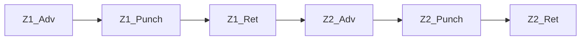

# Promaker LLM ↔ MCP — YAML 기반 프로토콜 설계 (v0)

> 본 문서는 *코드 변경 전* schema 확정 단계의 설계 문서입니다 (`--plan` 정신).
> 후속 PR 에서 PoC 구현 / 마이그레이션 / 기존 op-layer 도구 정리가 단계적으로 이어집니다.

---

## 1. 배경 — 왜 protocol 을 갈아엎는가

### 1.1 현재 흐름의 관찰

사용자가 자연어로 사양을 주면 LLM 이 entity 단위 mutation op 으로 분해하여 MCP 에 전송, MCP 가 Promaker 모델을 구축합니다. 실제 로그 (`ds2.log20260512` turn #2) 에서 관찰된 한 turn 의 모습:

| 항목 | 값 |
|---|---|
| 자연어 사양 | "Part 가 구역1/2/3 순차 이동, 각 구역 cylinder N개 동시 전진 후 Pusher Punch 후 동시 후진" |
| LLM 분해 결과 | 62 op (`apply_operations` batch) |
| API duration | 124 초 |
| Output tokens | 15,013 |
| Thinking signature | 13~21 KB |
| 재시도 round-trip | 1회 발생 (`BATCH_ERROR: args.apiNames 가 array 가 아닙니다 (ValueKind=String)`) |
| 비용 | $0.61 / turn |

### 1.2 문제 — LLM 책임이 너무 낮은 layer 에 묶여 있다

LLM 이 *자기 머리로* 처리해야 하는 일:

1. **entity 분해** — Station/Zone/Punch → Active System / Flow / Work / Call / Arrow / ApiDef 그래프 변환
2. **GUID chaining** — `add_work` 결과 GUID 를 `add_call(workId=GUID)` 로 전달
3. **batch ref 메커니즘** — `@cyl`, `@advW` 같은 sub-ref 정의 / 참조 순서
4. **cascade 규칙** — Passive 의 Flow + Work×N + ApiDef×N + ResetReset Arrow canonical
5. **quota 사전 산식** — `cascadeOpCount(N, opposing) = 3 + 2N + …` 자가 계산, 1600 임계 분할
6. **arrow 위상** — Start / Reset / StartReset / ResetReset / Group / Unspecified 결정
7. **read-vs-mutation 시점** — *같은 turn 안 read 는 mutation 반영 안 됨* 등 운영 규칙

→ prompt 가 *도구 30+ 정의 + 운영 규칙 + cascade 룰 + quota 산식* 으로 비대해지고, 매 turn thinking 으로 이 전부를 다시 reconstitute 해야 합니다. 비용·지연·재시도 빈도의 근본 원인.

### 1.3 잘못된 추상화 경계

현재 MCP layer 구조:

| 추상화 | 도구 예 | LLM 부담 |
|---|---|---|
| Pattern / Scenario | (없음) | LLM 이 매번 분해 |
| Station / Group | (없음) | LLM 이 매번 분해 |
| Device (1개) | `add_cylinder` / `add_robot` / `add_device` | 적정 |
| Entity primitive | `add_work` / `add_call` / `add_arrow` … | escape hatch 여야 할 도구가 *주력으로 사용 중* |

MCP 가 **DB schema CRUD primitive** 레벨에 머물러 있어, 자연어의 가장 흔한 단위 (Station, Zone, PartFlow) 가 *없음* — 분해 노동이 매 turn 반복됩니다.

### 1.4 검토한 대안 — helper layer 보강 (반려)

처음 검토한 방향: `add_station`, `add_part_flow` 같은 *더 큰 도메인 helper* 를 MCP 에 추가. 사용자 검토 결과 **반려** — 이유:

- helper 의 orchestration enum 이 사양 다양성을 다 흡수하지 못하면 escape hatch (primitive) 의존이 도리어 커짐
- helper / primitive 혼용 시 정합 깨질 위험
- **추상화 경계가 여전히 MCP 안에 있어, LLM 의 layer 부담 자체는 줄지 않음**

### 1.5 채택 방향 — *layer 자체를 뒤집는다*

LLM 의 강점과 약점을 다시 정리:

|  | LLM | MCP (F# 코드) |
|---|---|---|
| **잘하는 일** | 자연어 → 구조화된 표현 변환, 도메인 어휘 해석, 사양 모호성 해결 | 정확한 트랜잭션, 검증, cascade, GUID 관리 |
| **못하는 일** | 정확한 GUID chaining, 정밀 카운트, op 순서 일관성 | 자연어 이해 0 |

현재 layer 는 *정확히 거꾸로* 위임하고 있습니다. **LLM 에게 graph 구축을, MCP 에게 자연어를 안 시킬** 뿐, 가운데의 *graph 변환* 책임을 LLM 이 떠안고 있는 셈.

**올바른 분리**:

- **LLM 책임** = 자연어 → **구조화된 선언적 문서**
- **MCP 책임** = 문서 → entity graph 변환 + 검증 + cascade + 트랜잭션

문서의 *형식* 은 두 갈래로 나뉩니다 — 자세한 결정 배경은 §8 부록 참조:

- **Wire format (LLM ↔ MCP 통신)** = JSON object — tool_use input 의 native form, escape 0, LLM 정확도 최상.
- **Presentation format (사람 시야 / 디스크 SSOT / git diff)** = YAML — 들여쓰기 시각화, 주석 가능, diff 친화.

두 포맷의 *schema 는 1:1 동형* (키 이름·중첩 동일) — YamlDotNet round-trip 변환으로 자유 전환. 본 v0 문서의 §2~§3 예시는 *YAML 표기* 로 보여드리지만, 실제 wire 의 JSON 도 동일 구조입니다.

### 1.6 YAML doc-level protocol 의 이점

| 측면 | 현재 (op-level) | YAML doc-level |
|---|---|---|
| LLM 책임 | 사양 분해 + entity 분해 + GUID + cascade + quota + ref 순서 | **사양 → YAML 변환만** |
| MCP 책임 | primitive CRUD 21개 도구 | **YAML processor 1개** (cascade 룰 응축) |
| 도메인 룰 위치 | LLM prompt / helper / ToolOperations 분산 | **MCP 한 곳에 응축** (SSOT) |
| 사양 SSOT | 자연어 채팅 → 휘발 | **YAML 이 디스크 SSOT** (diff / PR / revert) |
| Round-trip | N + 재시도 위험 | 1 (validate + apply) |
| Prompt token | 도구 정의 + cascade + quota + 에러 매뉴얼 | **schema 한 장** |
| 사용자 직접 편집 | 불가 | **가능** — LLM 우회 / 검토 / 수동 보정 |
| Export 대칭 | impossible | **모델 → YAML export 자연** (round-trip 가능) |
| GUID | LLM 이 chaining 책임 | **LLM 에 노출 안 됨** |

### 1.7 결정 사항 요약 (그 배경)

| 결정 | 배경 |
|---|---|
| **Wire = JSON object / View = YAML** | tool_use input 이 원래 JSON 이라 YAML 을 string field 에 넣으면 이중 escape 비용 (token 낭비 + LLM 출력 안정성 ↓). LLM 통신은 JSON object 직접 전달, 사용자 노출·디스크 저장은 YAML 렌더. 두 포맷 schema 동형. **§8 부록 상세** |
| **GUID 완전 추상화** | LLM 부담의 큰 비중. 이름 기반 참조 + Promaker 의 unique-name 룰이 이를 자연히 가능케 함 |
| **이름 기반 dotted-path** | 모호성 0 우선 (사용자 결정). LLM 부정확은 prompt 지침 + validate 에러 메시지 (가까운 후보) 로 커버 |
| **entity 이름에 `.` 금지** | path 구분자 `.` 와 충돌 회피. `sanitizeName` 에 `.` 거부 추가 (Phase 1 작업). 기존 코드 베이스의 이름들 검토 / rename 필요할 수 있음 |
| **Patch add+remove 룰** | 같은 patch 안 *원래 있던 것 제거 + 신규 추가* 는 자유. *방금 추가한 것 즉시 제거* 는 미지원 (자기 모순). 현재 `queueRemoveEntity` 가 그대로 보장 |
| **Project 키 자동 처리 (mode 인자 폐기)** | LLM 이 store 상태 인지하여 `project:` 키 생략·동일 이름 사용으로 자연 merge. 사용자가 새 project 명시하면 LLM 이 GUI 닫기 안내. MCP 는 시나리오별 자동 처리 (§4 표 참조). 별도 `mode` 인자 없음 |
| **Arrow 옵션 A `A -> B : Type`** | arrowType 6종 명시성 우선. ASCII art 인코딩 (옵션 B) 은 LLM 정확도 ↓ |
| **device F# DU literal** | known 3종 (cylinder/clamp/robot, F# helper 매핑) + custom 확장성을 *동일 표기* 로 통합. `device: custom(WedgeClamp)` 가 valid YAML scalar 로 자연 표현 |
| **`kind:` 명시 강제** | 사용자 검토/편집 시 한눈에 보이도록. 추론 정책은 명시성과 trade-off — 명시성 우선 |
| **ApiDef 중복 Call — 그대로 허용 (alias/#index 폐기)** | 같은 Work 안 같은 ApiDef 가 N회 Call 가능 — concurrent 의 자연 표현. **alias / `#index` 표기 폐기** (단순성 우선). Arrow source/target 으로 중복 이름 참조 시만 validate 에러 (concurrent OK, 순차 chain 은 중복 불가). 코드: `hasCallNameClash` 함수 *자체는 그대로 유지* (기존 op-layer 회귀 차단). **신규 entry `queueAddCallAllowDup`** 추가하여 YAML dispatcher 의 *concurrent path* 에서만 호출 (Phase 1 작업) |
| **새 도구 명명 = `Doc` 접미사** | 기존 `ValidateModel` (consistency check) 과 충돌 회피. 신 도구는 `ApplyModelDoc` / `ValidateModelDoc` / `ExportModelDoc` 으로 차별화 |
| **Known device sugar = 3종 한정** | `cylinder` / `clamp` / `robot` 만 단축형 (`queueAddCylinder/Clamp/Robot` 매핑). 그 외 (pusher / conveyor / agv / gripper / lifter / crane 등) 모두 `custom(<Type>) + apis: [...]` long-form |
| **opposing default 그대로** | known device 의 GUI canonical 형상과 정합 보존 (cylinder/clamp=chain, robot=none). custom 의 default 는 `none` |
| **patch DSL v0 포함** | 점진 mutation 도 GUID 없는 이름 기반 path 로 표현 가능. 별도 v0.1 분리는 분할 비용 > 이익 |
| **`workDuration` 키 통일** | Active Work duration override 와 Passive device duration 동일 의미·동일 type → 단일 키 `workDuration: <duration>`. 옛 `duration:` 표기 폐기 |
| **Call 참조는 systemName 사용 — alias 무시** | Promaker 내부 모델의 `Call.DevicesAlias` (GUI 사용자가 부여한 약어) 는 doc-level 추상화에서 *무시*. doc 표기 `calls: [Cyl1.ADV]` 의 `Cyl1` 은 **Passive system 이름**. 이유: ① LLM 부담 최소화 (alias 별도 개념 불필요) ② doc round-trip 시 alias→systemName 정정으로 단일 표기 보장. **결과**: GUI 가 alias≠systemName 으로 저장한 store 를 export 시 systemName 으로 정정 emit (alias 정보 손실). 의미적 동등은 보존 — ApiDef 식별이 정확. **구현**: `exportToJson` 의 calls emit 에서 `c.DevicesAlias` 대신 `ApiDef.ParentSystem.Name` 사용 (Phase 2 작업). dispatcher (apply) 는 변경 없음 — 이미 systemName 기준 resolve. 데이터 무결성 깨진 store (ApiCall 빈/ApiDefId None/orphan ApiDef·System) 에 도달 시 `c.DevicesAlias` fallback + log4net `WARN` 으로 forensic 단서 (Phase 2 cycle3 외부 review M2 반영) |
| **`custom(Unknown)` fallback (Passive SystemType=None)** | 비정상 store — Passive system 인데 `SystemType` 가 `None` 인 경우. export 는 `device: custom(Unknown), apis: [...]` long-form 으로 fail-safe emit + log4net `WARN`. **주의**: 이 export 결과를 다시 apply 하면 dispatcher 가 `Custom "Unknown"` → `SystemType = Some "Unknown"` 으로 굳음 (silent type mutation). 정상 GUI/helper 흐름은 SystemType ≠ None 보장 → 도달 가능성 0 가까움. 도달 시 logger forensic 단서 + 사용자 인지로 대응 (Phase 2 cycle3 외부 review M1 반영) |
| **`inferOpposing` N=2 정규화 = chain** | Passive internal Flow 의 apiCount=2 + ResetReset=1 케이스에서 *chain* 과 *all-pairs* 가 동일 (둘 다 1 arrow). 정규화 정책: **chain** 으로 분류 (`inferOpposing` 의 `apiCount - 1` 분기가 `all-pairs` 분기보다 먼저 매칭). 의미: cylinder/clamp 등 N=2 sugar 의 default opposing 과 정합 — export 결과 키 생략 (Phase 2 cycle3 외부 review L4 반영) |

---

## 2. Schema v0 — 한 페이지 reference

### 2.0 Parser subset (YAML feature 제한)

LLM/사람 입력 안정성·보안 위해 YAML 표준의 일부 feature 만 허용:

| Feature | 정책 | 사유 |
|---|---|---|
| Anchor `&` / Alias `*` | **금지** (validate 에러) | 동일 표현 다중 경로 → diff/SSOT 의미 모호 |
| Custom tag `!tag` | **금지** | type coercion 표면 ↑, parser 복잡도 ↑ |
| Merge key `<<:` | **금지** | 동상 |
| YAML 1.1 boolean coercion (`yes/no/on/off`) | **금지** — 모든 unquoted scalar 는 string 으로 해석 (YAML 1.2 core schema) | `device: on` 같은 의도치 않은 bool 변환 차단 |
| Duplicate map key | **에러** | 명시성 |
| Flow style (`{}` / `[]`) | 허용 | 예시 §3 사용 중 |
| Multi-document `---` | **금지** | 단일 document 만 |
| Unicode | NFC 정규화 후 lookup (M-J) | 한글 자모 분해형 입력도 NFC 합성형으로 매칭 |

위 정책은 wire (JSON object) 에는 자연 적용 (JSON 에 anchor/tag/merge 자체 없음). YAML view → JSON 변환 시 YamlDotNet 의 `StaticBuilder` + 사전 reject 단계로 강제.

### 2.1 전체 구조

```yaml
protocol: promaker/v0             # [MUST] 필수 — schema 버전 식별. v0 → v1 breaking change 시 증가
project: <name>                   # 단일 project (다중 project v0 제외)

systems:                          # 시스템 목록 (순서 무관 — forward-ref 허용)
  - system: <name>
    kind: active | passive        # 항상 명시
    ...                           # kind 별 키 (아래)

patch:                            # (선택) 점진 mutation — 새로 만드는 모델만 있으면 생략
  add:    [...]
  arrows: { add: [...] }
  rename: [...]
  remove: [...]
```

**[MUST] `protocol:` 키**: 최상단 첫 키. 값은 `promaker/v0` (v0 동안 고정). 미일치 시 validate 에러: `ERROR: protocol 키 누락 또는 미지원 버전. 'promaker/v0' 명시 필요.`

### 2.2 Active system

```yaml
- system: Controller
  kind: active
  flow <FlowName>:                # Flow N개 가능 — 키 prefix "flow " 로 식별
    works:
      <WorkName>:
        calls:                    # ApiDef 참조 — dotted-path
          - <System>.<ApiDef>     # 같은 이름 N회 등장 가능 (concurrent 의미)
        arrows:                   # (선택) ArrowBetweenCalls — source/target 으로 같은 이름 중복 시 validate 에러
          - <System>.<ApiDef> -> <System>.<ApiDef> : <ArrowType>
      <WorkName>:
        ...
    arrows:                       # ArrowBetweenWorks
      - <WorkName> -> <WorkName> : <ArrowType>
```

### 2.3 Passive system

```yaml
- system: <name>
  kind: passive
  device: <DU literal>            # 권장 — known/custom 통합
  # (선택) device sugar 가 펼치는 값을 override 하려면 아래 키 명시:
  apis: [<ApiDef>, ...]           # default 는 device 별 표준 (cylinder=[ADV,RET])
  opposing: none | chain | all-pairs   # default 는 device 별 표준
  workDuration: <duration>        # default 500ms. grammar = ^\d+(ms|s)$ (예: 500ms, 2s). wire JSON 도 string 표기
```

**`<duration>` scalar grammar** (Active Work duration override 와 Passive workDuration 공통):
- regex: `^(\d+)(ms|s)$`
- JSON wire 표기도 **string** (예: `"500ms"`) — number coercion 없음
- 단위 누락 / 음수 / 부동소수 등은 validate 에러

**device DU literal 문법**:
```
<known-case>                      # 현재 sugar 정의 = cylinder, clamp, robot (ToolOperations 의 queueAdd* helper 존재)
custom(<deviceType-name>)         # 예: custom(WedgeClamp), custom(Pusher), custom(Conveyor)
```

Parse regex: `^([A-Za-z][A-Za-z0-9_]*)(?:\(([A-Za-z][A-Za-z0-9_]*)\))?$`. ASCII-only 강제 (한글/Unicode device 명 불허). case 명은 case-insensitive (`cylinder` = `Cylinder`).

**Known case 의 sugar 매핑** (Phase 1 에서 확정):

| case | F# 함수 | default `apis` | default `opposing` | default `workDuration` |
|---|---|---|---|---|
| `cylinder` | `queueAddCylinder` | `[ADV, RET]` | `chain` | 500ms |
| `clamp` | `queueAddClamp` | `[CLP, UNCLP]` | `chain` | 500ms |
| `robot` | `queueAddRobot` | (사용자 지정 필수) | `none` | 500ms |

위 3종 외 (pusher / conveyor / agv / gripper / lifter / crane 등) 는 **`device: custom(<Type>) + apis: [...]` long-form 강제** (§1.7 결정 완료 — sugar 3종 한정). §3 예시에서 pusher 등은 모두 `device: custom(Pusher), apis: [PUNCH]` 처럼 long-form 으로 표기.

### 2.4 Arrow 표기

```
<From> -> <To> : <Type>
```

- **Type**: `Start` | `Reset` | `StartReset` | `ResetReset` | `Group` | `Unspecified`
- `Type` 누락 시 validate 에러 (default 두지 않음 — 의도 명시 강제). 단 *명시적 미정* 의도면 `: Unspecified` 로 표기 — *키 누락* (parse 에러) 와 *명시적 미정* (도메인 의미) 의 의도 분리
- `<From>` / `<To>` 는 *현재 scope* (Work 안 arrows = Call 식별자, Flow 안 arrows = Work 식별자)
- cross-scope 가 필요하면 full dotted-path

### 2.5 Path 룰

- segment 구분자 = `.` (canonical) 또는 `/` (혼용 허용). normalize 시점: **parse 직후 즉시 `/` → `.` 단일화**. 이후 모든 lookup/에러 메시지는 `.` 기준.
- 같은 부모 children 끼리는 **bare name** (예: Flow 안 arrows 의 `Z1_Adv -> Z1_Punch`)
- cross-parent / cross-system 은 **full dotted-path** (예: `Controller.Run.Z1_Adv`, `Z1_C1.ADV`)
- forward-ref 허용 (1-pass 이름 테이블 구축 → 2-pass GUID resolve)
- **entity 이름에 `.` (점) 금지** — segment 구분자 ambiguity 회피. `sanitizeName` 에 `.` 거부 추가 (Phase 1 작업). 예: 시스템 이름 `Z1.C1` 은 불허 → `Z1_C1` / `Z1-C1` / `Zone1Cyl1` 등 사용. ApiDef / Flow / Work 이름도 동일.

**Flow prefix 키 normalize**: schema 의 `flow <FlowName>:` 키는 다음 grammar 로 매칭, segment 추출 후 path 안에서는 *FlowName 만* 사용:

```
flow-key  = "flow" WS+ identifier
identifier = (\w | "_" | "-")+    ; ASCII only (Unicode 는 NFC 후 entity 이름 내부 허용, key 식별자는 ASCII)
WS         = " " | "\t"
```

예: `flow Run:` → key normalize → `Run` segment. path `Controller.Run.Z1_Adv` 의 `Run` 과 정합. 중복 prefix 키 (`flow Run:` 두 번) 는 validate 에러.

### 2.6 Patch DSL — 점진 mutation

```yaml
patch:
  add:
    - in: <PathToParent>          # 추가할 entity 의 부모 경로
      <key>: <value>              # 추가할 entity (system/work/call 등)

  arrows:                         # arrow 만 별도 — scope 가 부모와 다름 (Flow 단위)
    add:
      - in: <PathToFlow>
        entries:
          - <From> -> <To> : <Type>
    remove:
      - in: <PathToFlow>
        entries:
          - <From> -> <To>        # type 없이도 식별 가능 (from,to pair 가 unique)

  rename:
    - <OldPath>: <NewName>        # 이름만 변경 (path 의 last segment)

  remove:
    - <Path>                      # entity cascade 제거 (자식 + 관련 arrow)
```

**Patch 의 add+remove 룰**:
- **store 에 *원래 있던* entity 제거 + 신규 entity 추가** — 같은 patch 호출 안 자유 조합 가능 (자연 시나리오).
- **같은 호출 안에서 *방금 추가한* entity 를 곧바로 제거** — 미지원 (자기 모순적 시나리오). validate 단계가 에러 반환: `같은 patch 안 add 직후 remove 는 미지원 — patch 에서 add 자체를 빼시면 됩니다.` 코드 측은 `ToolOperations.fs` 의 `queueRemoveEntity` 기존 invalidOp 가 그대로 보장 (별도 보강 불필요).

### 2.7 Validate 단계 강제 룰

| # | 룰 | 에러 메시지 템플릿 |
|---|---|---|
| 1 | `kind: active\|passive` 누락 | `ERROR systems[i]: kind 누락. 'active' 또는 'passive' 명시 필요.` |
| 2 | `device` DU literal 문법 위반 | `ERROR systems[i].device: '{raw}' 인식 불가. 형식: <known-case> 또는 custom(<type>).` |
| 3 | dotted-path resolve 실패 | `ERROR <yamlPath>: '{ref}' 가 발견되지 않음. 가까운 후보: {top-3 Levenshtein}.` |
| 4 | ArrowBetweenCalls 의 source/target 이 중복 ApiDef Call 이름 참조 | `ERROR <yamlPath>.arrows: '{api}' 가 같은 Work 안에서 N회 호출되어 source/target 으로 식별 불가. 순차 chain 이면 중복 호출을 다른 Work 로 분리하세요.` |
| 5 | arrow type 누락 | `ERROR <yamlPath>.arrows[i]: type 누락. '{from} -> {to} : <Type>' 형식 사용.` |
| 6 | kind 와 키 불일치 | `ERROR systems[i]: kind=passive 인데 flow 키 존재 (또는 그 반대). 어느 한 쪽 수정.` |

---

## 3. 예시

### 3.1 단일 cylinder

```yaml
project: M1

systems:
  - system: Controller
    kind: active
    flow Run:
      works:
        Adv:
          calls: [Cyl1.ADV]
        Ret:
          calls: [Cyl1.RET]
      arrows:
        - Adv -> Ret : Start

  - system: Cyl1
    kind: passive
    device: cylinder
```

### 3.2 Multi-zone Part flow (로그 turn #2 사양)

```yaml
project: M1

systems:

  # ─ Active 컨트롤러 ────────────────────────────────────
  - system: Controller
    kind: active
    flow Run:
      works:
        Z1_Adv:    { calls: [Z1_C1.ADV, Z1_C2.ADV] }
        Z1_Punch:  { calls: [P1.PUNCH] }
        Z1_Ret:    { calls: [Z1_C1.RET, Z1_C2.RET] }
        Z2_Adv:    { calls: [Z2_C1.ADV, Z2_C2.ADV, Z2_C3.ADV] }
        Z2_Punch:  { calls: [P2.PUNCH] }
        Z2_Ret:    { calls: [Z2_C1.RET, Z2_C2.RET, Z2_C3.RET] }
        Z3_Adv:    { calls: [Z3_C1.ADV, Z3_C2.ADV, Z3_C3.ADV, Z3_C4.ADV] }
        Z3_Punch:  { calls: [P3.PUNCH] }
        Z3_Ret:    { calls: [Z3_C1.RET, Z3_C2.RET, Z3_C3.RET, Z3_C4.RET] }
      arrows:
        - Z1_Adv   -> Z1_Punch : Start
        - Z1_Punch -> Z1_Ret   : Start
        - Z1_Ret   -> Z2_Adv   : Start
        - Z2_Adv   -> Z2_Punch : Start
        - Z2_Punch -> Z2_Ret   : Start
        - Z2_Ret   -> Z3_Adv   : Start
        - Z3_Adv   -> Z3_Punch : Start
        - Z3_Punch -> Z3_Ret   : Start

  # ─ Passive 디바이스 ───────────────────────────────────
  - { system: Z1_C1, kind: passive, device: cylinder }
  - { system: Z1_C2, kind: passive, device: cylinder }
  - { system: Z2_C1, kind: passive, device: cylinder }
  - { system: Z2_C2, kind: passive, device: cylinder }
  - { system: Z2_C3, kind: passive, device: cylinder }
  - { system: Z3_C1, kind: passive, device: cylinder }
  - { system: Z3_C2, kind: passive, device: cylinder }
  - { system: Z3_C3, kind: passive, device: cylinder }
  - { system: Z3_C4, kind: passive, device: cylinder }
  - { system: P1, kind: passive, device: custom(Pusher), apis: [PUNCH] }
  - { system: P2, kind: passive, device: custom(Pusher), apis: [PUNCH] }
  - { system: P3, kind: passive, device: custom(Pusher), apis: [PUNCH] }
```

비교:
- 현재 op-layer: **62 op** / output 15K tok / $0.61 / 재시도 위험
- 위 YAML: ~80 라인 / 1 round-trip / GUID 0개 / 재시도 없음 (forward-ref 는 2-pass parse + 1 wire round-trip)

### 3.3 Custom device + ArrowBetweenCalls + ApiDef 중복 Call

**중복 Call 룰** (결정 완료):
- 같은 Work 안 같은 ApiDef 가 N 회 등장 OK (concurrent 의 자연 표현 — alias/`#index` 표기 *없음*)
- ArrowBetweenCalls 의 source/target 으로 *그 중복 이름* 을 참조하면 validate 에러 — 순차 chain 에서는 ApiDef Call 이 고유해야 모호성 0
- 즉 *concurrent 의미 = 중복 자유*, *순차 의미 = 각 Call ApiDef 고유*
- 코드 변경 (Phase 1): `ToolOperations.fs` 의 `hasCallNameClash` 완화 — 거부 → 허용

```yaml
project: Jig1

systems:
  - system: Controller
    kind: active
    flow Test:
      works:
        Sequence:
          # 중복 없는 단순 순차 — ArrowBetweenCalls 로 chain
          calls: [Jig.TILT_UP, Jig.HOLD, Jig.TILT_DOWN]
          arrows:
            - Jig.TILT_UP -> Jig.HOLD       : Start
            - Jig.HOLD    -> Jig.TILT_DOWN  : Start

        Concurrent:
          # 중복 OK — concurrent 의미 (arrow 없음)
          calls: [Jig.TILT_UP, Jig.TILT_UP, Jig.TILT_DOWN]   # TILT_UP 2 회 동시

  - system: Jig
    kind: passive
    device: custom(TiltingJig)
    apis: [TILT_UP, HOLD, TILT_DOWN]
    opposing: chain
    workDuration: 700ms
```

### 3.4 Patch — 기존 모델에 Zone 4 추가

```yaml
patch:
  add:
    - in: Controller.Run.works
      Z4_Adv:    { calls: [Z4_C1.ADV, Z4_C2.ADV] }
      Z4_Punch:  { calls: [P4.PUNCH] }
      Z4_Ret:    { calls: [Z4_C1.RET, Z4_C2.RET] }
    - { system: Z4_C1, kind: passive, device: cylinder }
    - { system: Z4_C2, kind: passive, device: cylinder }
    - { system: P4,    kind: passive, device: custom(Pusher), apis: [PUNCH] }

  arrows:
    add:
      - in: Controller.Run
        entries:
          - Z3_Ret   -> Z4_Adv   : Start
          - Z4_Adv   -> Z4_Punch : Start
          - Z4_Punch -> Z4_Ret   : Start

  rename:
    - Z1_C1: Zone1_Cylinder1

  remove:
    - Controller.Run.Z3_Punch       # Work cascade — 자식 + 관련 arrow 자동
```

---

## 4. 새 MCP 도구 (proposed)

기존 30+ 개 op 도구는 *escape hatch* 로 유지. 주력 진입점은 아래 3개. **Wire = JSON object**, view 변환은 별도 도구.

```
mcp__promaker__apply_model_doc(model: object, dryRun: bool = false)
  → input: §2 schema 의 JSON object (LLM 의 tool_use input 으로 직접 전달, escape 0)
  → 성공: { commitId, opCount, summary, refs: {<name>: <guid> opt.} }
  → 실패: { errors: [{path, message, suggestion?}], ... }

mcp__promaker__validate_model_doc(model: object)
  → dry-run 결과만 (mutation 없음). LLM 의 사전 self-check 용.
  ※ 기존 mcp__promaker__validate_model (모델 일관성 검사) 와 *별개 도구* — 이름 충돌 회피로 `_doc` 접미사.

mcp__promaker__export_model_doc(scope: "project" | "system:<name>" = "project", format: "json" | "yaml" = "yaml")
  → 현재 모델의 선언적 표현. 사용자 저장 / round-trip 검증.
  → format=yaml: 사람 친화 view (디스크 SSOT). format=json: wire 와 동일.
```

**Project 키 처리 정책** (LLM 책임 + MCP 시나리오별 자동 처리):

1. **LLM 책임** (prompt 측 규약):
   - store 에 *이미 project 가 열려 있다*는 사실을 LLM 이 인지 (snapshot / `<editor_changes>` block 으로 자동 전달됨)
   - 사용자가 *명확히 새 프로젝트* 를 지정하지 않은 한, LLM 은 `apply_model_doc` 의 `project:` 키를 **생략하거나 기존 project 이름 그대로** 사용 → 기존 project 안 systems 추가로 자연 귀속
   - 사용자가 *명시적 새 프로젝트* 요청 → LLM 은 사용자에게 "기존 프로젝트를 '파일 > 닫기' (Ctrl+Shift+W) 로 닫아주세요" 안내. LLM 이 자가 결정으로 기존 project 를 close 시키지 않음 (사용자 작업 보호)

2. **MCP 동작** (`apply_model_doc` 의 시나리오별):

| Store 상태 | `project:` 키 | MCP 동작 |
|---|---|---|
| 빈 store | 있음 (name=X) | 새 project X 생성, systems add |
| 빈 store | 없음 | 에러 — *빈 store 에서 시작하려면 project 이름 명시 필요* |
| project P 있음 | 없음 또는 `project: P` (동일) | P 에 systems 추가 (자연 merge) |
| project P 있음 | `project: Q` (다른 이름) | 에러 — *프로젝트 P 가 이미 열려 있습니다. Q 로 바꾸려면 '파일 > 닫기' 후 재시도하세요* |

→ 별도 `mode` 인자 불필요. LLM 의 prompt 책임 + MCP 의 명확한 에러 메시지로 자연스럽게 흐름 분리.

> **이름 정책** (결정 완료): 기존 `[McpServerTool] ValidateModel` (`ModelTools.cs` 의 모델 일관성 검사) 은 그대로 유지. 본 v0 protocol 의 새 도구는 모두 **`Doc` 접미사** 로 차별화 — `ApplyModelDoc` / `ValidateModelDoc` / `ExportModelDoc`. snake_case 매핑 시 `_doc` suffix.

**보조 도구 (사용자 편집 워크플로용)**:
```
mcp__promaker__yaml_to_json(yaml: string) → object   # 사용자가 YAML 편집 후 apply 직전 변환
mcp__promaker__json_to_yaml(model: object) → string  # apply 응답을 YAML 로 미리보기 (UI)
```

**신규 도구 수 SSOT** (Phase 1 추가분):
- LLM 노출 확정 = 3 (`apply_model_doc` / `validate_model_doc` / `export_model_doc`)
- LLM 노출 잠정 = 1 (`json_to_yaml` — apply 응답 YAML preview 용)
- LLM 비노출 = 1 (`yaml_to_json` — UI 편집 워크플로 내부 helper. LLM 노출 여부는 PoC 중 결정, todo §3.4.4 참조)
- 합계 4~5종 → `PromakerToolNames.cs:All` allowlist 추가분 4~5 + `PromakerToolNamesDriftTests.fs` sanity count 21 → **25 (잠정)** 또는 26 (yaml_to_json 노출 시)

**LLM 측 사용 룰**:
- LLM 은 `apply_model_doc` / `validate_model_doc` 만 사용 (JSON object 직접 생성).
- `yaml_to_json` / `json_to_yaml` 은 *사용자 UI 편집 워크플로* 용 — LLM 호출 대상 아님.
- prompt 에 schema 예시는 *YAML 표기로 제공* 가능 (사람이 읽기 좋음) — LLM 이 그 의미를 JSON object 로 변환하는 건 native 능력.

---

## 5. 기존 op-layer 와의 매핑 (구현용 메모)

| YAML 키 | 재사용 가능한 F# 함수 (`Solutions/Core/Ds2.LlmAgent/ToolOperations.fs`) |
|---|---|
| `system: ..., kind: active` | `queueAddActiveSystem` |
| `system: ..., kind: passive, device: cylinder` | `queueAddCylinder` |
| `system: ..., kind: passive, device: clamp` | `queueAddClamp` |
| `system: ..., kind: passive, device: robot` | `queueAddRobot` |
| `system: ..., kind: passive, device: custom(<T>)` | `queueAddDevice` |
| `system: ..., kind: passive` (device 키 부재) | `queueAddPassiveSystem` — device 미지정 단순 Passive (validate 에러 vs 허용은 PoC 중 결정, 잠정 허용) |
| `flow <Name>:` | `queueAddFlow` |
| `<WorkName>:` (Work) | `queueAddWork` |
| `calls: [...]` — *순차 chain* (Work 안 arrows 있음) | `queueAddCall` (기존 — 중복 차단 유지) |
| `calls: [...]` — *concurrent* (Work 안 arrows 없음, 중복 허용) | **`queueAddCallAllowDup`** (신규) |
| `arrows: - A -> B : T` | `queueAddArrow` |
| `patch.rename` | `queueRenameEntity` |
| `patch.remove` | `queueRemoveEntity` |

→ **YAML processor 는 *얇은 transformer***. cascade / canonical 로직은 기존 함수 재사용. 새로 작성할 코드는 (a) YAML parse + ast (b) 이름 → entity 테이블 + resolver (c) 위 매핑 dispatcher (d) 에러 메시지 (가까운 후보 Levenshtein).

---

## 6. 마이그레이션 / 단계 계획

| Phase | 작업 | 기존 op-layer |
|---|---|---|
| **0** (본 문서) | schema v0 확정 | 그대로 운영 |
| **1** | `validate_model_doc` / `apply_model_doc` PoC — 위 §3 의 3.1, 3.2 예시 round-trip 통과까지. JSON object 입력 + YamlDotNet 양방향 변환 helper | 그대로 운영 |
| **2** | `export_model_doc` 구현 (format=json/yaml) — 기존 sample 모델 (WithCyl.json 등) round-trip 검증 | 그대로 운영 |
| **3** | LLM prompt 마이그레이션 — `3.tooling.md` 를 YAML 기준으로 재작성, op-layer 는 escape hatch 섹션으로 강등 | 유지 (escape hatch) |
| **4** | UI: 채팅 패널의 YAML preview + apply 버튼 (사용자 검토 UX) | 유지 |
| **5** (장기) | op-layer 도구 중 사용 빈도 0 인 것 deprecation | 점진 정리 |

---

## 7. 남은 미결정 / 추후 결정

- **Active system 의 직접 ApiDef** — `add_api_def(name, systemId, txWorkId?, rxWorkId?)` 는 Active 측 API 정의. 본 v0 은 Passive 의 device sugar 만 다룸. Active 가 ApiDef 직접 정의해야 하는 사례 (e.g. Active 가 외부 노출 인터페이스) 확인 후 키 추가.
- **arrowType `Group` / `Unspecified` 의 실제 사용 빈도** — 실측 후 default 정책 고려 (현재는 무 default).
- **patch 안 cross-system 추가의 scope 표기** — `in: <system-path>` 가 root 인 경우 vs `systems:` add list — 위 §3.4 는 후자 형태. 통일 검토.
- **Error message 의 i18n** — 한국어 vs 영어. 현재 ToolOperations.fs 의 VALIDATION_ERROR 는 한국어. 정책 일치.

위 4가지는 PoC (Phase 1) 진행 중 *실제 사례를 만나는 시점에* 결정합니다. 사전 over-design 회피.

**§2.5 / §2.6 / §4 의 design 결함 3건은 결정 완료** (위 §1.7 결정 표 확정 룰 참조):
- *path 구분자 vs 시스템 이름 dot* → 시스템 이름에 `.` 금지 확정 (§2.5)
- *patch 의 add+remove* → 자기 모순 케이스만 미지원, 자연 케이스 허용 확정 (§2.6)
- *apply_model 의 project 키 처리* → mode 인자 폐기, LLM 책임 + MCP 시나리오별 자동 처리 확정 (§4)

---

## 8. 부록 — Wire format 검토 (왜 JSON object 인가)

### 8.1 의문의 출발

처음 v0 초안은 *LLM ↔ MCP 통신 자체가 YAML* (즉 `apply_yaml(yaml: string)`) 이었으나, 한 가지 핵심 관찰로 재검토:

> **LLM 의 tool_use input 은 원래 JSON object 다.** YAML 을 string field 로 넣으면 LLM 은 줄바꿈 `\n`, 따옴표 `\"`, 백슬래시 등을 *이중 escape* 해야 한다.

이 비용은 단순 token 낭비를 넘어:
- LLM 출력 안정성 ↓ (긴 escape 시퀀스에서 종종 실수)
- 본 v0 의 핵심 목표 *"LLM 부담 최소화"* 와 정면 충돌
- string 안 줄바꿈/들여쓰기 의존 → parse 실패 시 디버깅 어려움

### 8.2 후보 비교

| 후보 | LLM 정확도 | 사람 친화 | escape 비용 | parser | 비고 |
|---|---|---|---|---|---|
| **JSON object (wire)** | **최상** | 낮음 (verbose, 주석 X) | **0** | 표준 | tool_use native form |
| YAML string-in-JSON | 좋음 | 매우 좋음 | string-in-JSON 이중 escape | YamlDotNet | 사람 SSOT 강점 |
| JSON5 / JSONC | 매우 높음 | 중간 (주석 가능) | string-in-JSON escape | NuGet | JSON 의 사람 친화 보강 |
| Markdown + YAML frontmatter | 높음 | 매우 좋음 | escape 큼, layer 다중 | 다층 parser | over-engineering |
| Mermaid flowchart | 중간 | 매우 좋음 (시각) | escape | custom | meta (kind, device) 표현 약 |
| Custom indented DSL | 낮음 (corpus 적음) | 매우 좋음 | escape | 자작 | LLM 학습 데이터 부족 |
| F# DU-literal text | 낮음 | 사용자 친숙 | escape | 자작 | 동일 — corpus 부족 |
| TOML | 좋음 | 중간 | escape | 표준 | 깊은 중첩 부적합 |

### 8.3 채택안 — *역할 분리*

```
┌─────────────────────────────────────────────────────────────────┐
│ 사용자 / 디스크 SSOT       │   *.yaml   ←─ 사람이 읽고 편집          │
│      ↕ (yaml_to_json /     │                                       │
│        json_to_yaml)        │                                       │
│ LLM ↔ MCP wire             │   JSON object ←─ tool_use native      │
│      ↕ (apply_model /       │                                       │
│        export_model)        │                                       │
│ Promaker store              │   in-memory entity graph (F# record)  │
└─────────────────────────────────────────────────────────────────┘
```

각 layer 가 *자기 강점에 맞는 포맷*:
- **LLM 통신** = JSON (정확도·escape 0)
- **사람 시야** = YAML (들여쓰기·주석·diff 친화)
- **Promaker 내부** = F# record (타입 안전)

**핵심 보장**: YAML/JSON 의 **schema 는 1:1 동형** (키 이름·중첩 구조 동일). 변환은 YamlDotNet round-trip 한 줄로 충분. 본 v0 문서의 §2~§3 예시는 YAML 표기로 보여드리지만, *동일한 의미의 JSON* 도 동일 구조를 가집니다.

### 8.4 보조 옵션 — Mermaid 시각화 (display-only)

Wire format 후보로는 부적합하지만, **export 의 *세 번째 view*** 로는 가치 있습니다:



채팅 패널에 *생성된 모델 다이어그램* 으로 함께 렌더 → 사용자가 arrow 위상을 한눈에 검증. *입력은 받지 않음* (display only). Phase 4 (UI) 의 가치 추가 항목으로 고려.

### 8.5 거절된 다른 절충안

- **JSON 단독 (YAML view 없음)**: 디스크 SSOT 가 JSON 이 되면 git diff noisy + 주석 불가 → 사용자 검토 UX 저하. 거절.
- **YAML 단독 (JSON wire 없음)**: 위 §8.1 의 이중 escape 비용. 거절.
- **사용자가 *YAML 만 알면 됨*, LLM 만 *JSON 만 알면 됨*** — 두 layer 의 동형 schema 가 인지 부담 거의 0. 사용자에게는 YAML 문서만 노출하면 충분.
