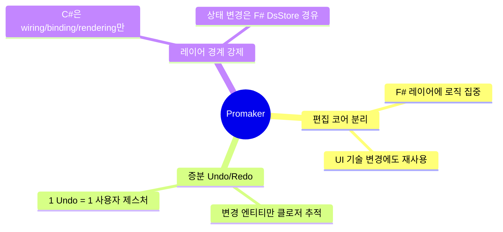
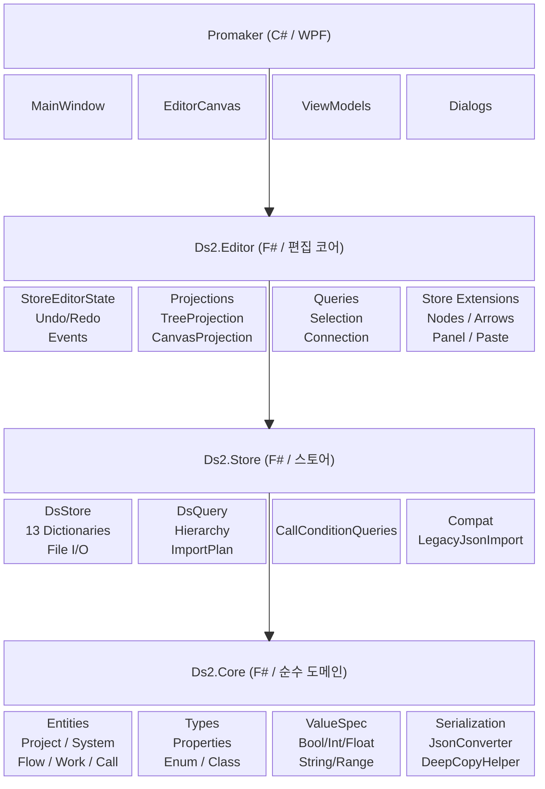
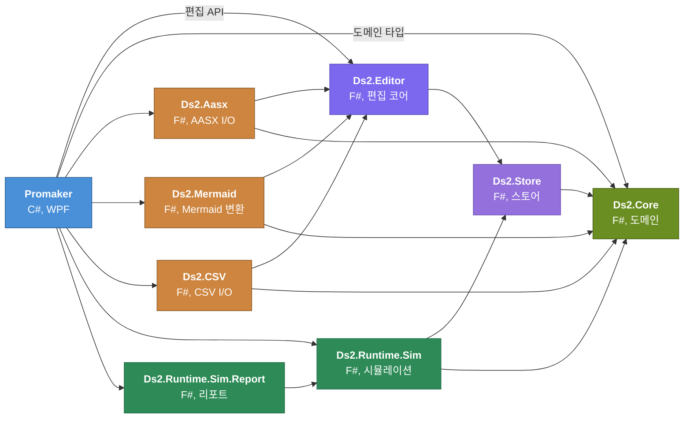
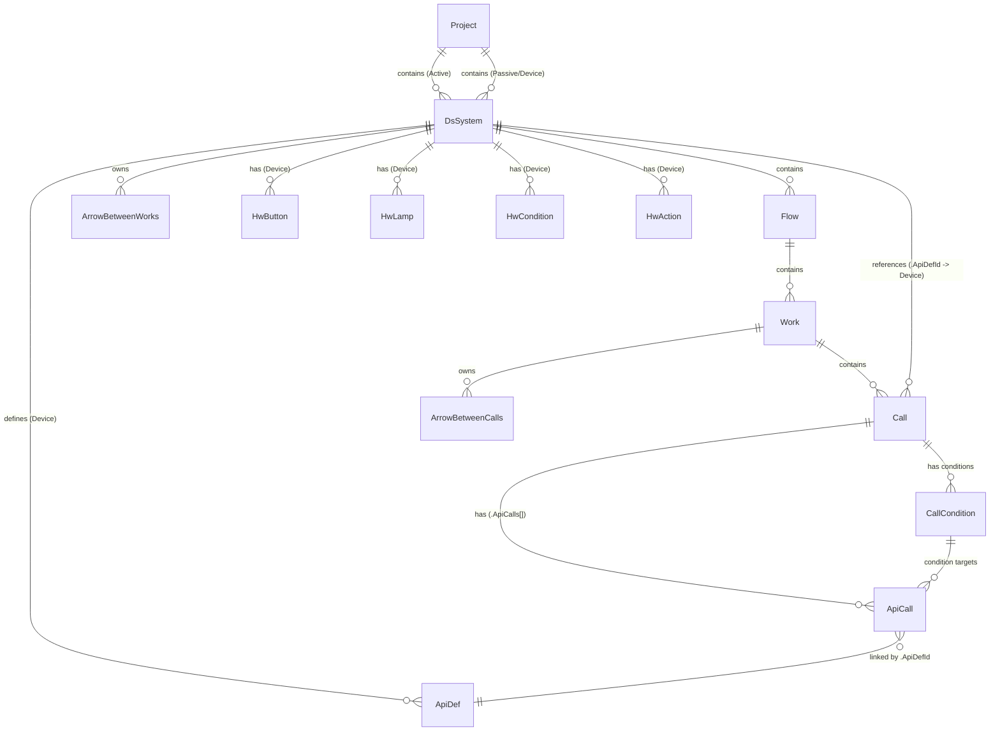
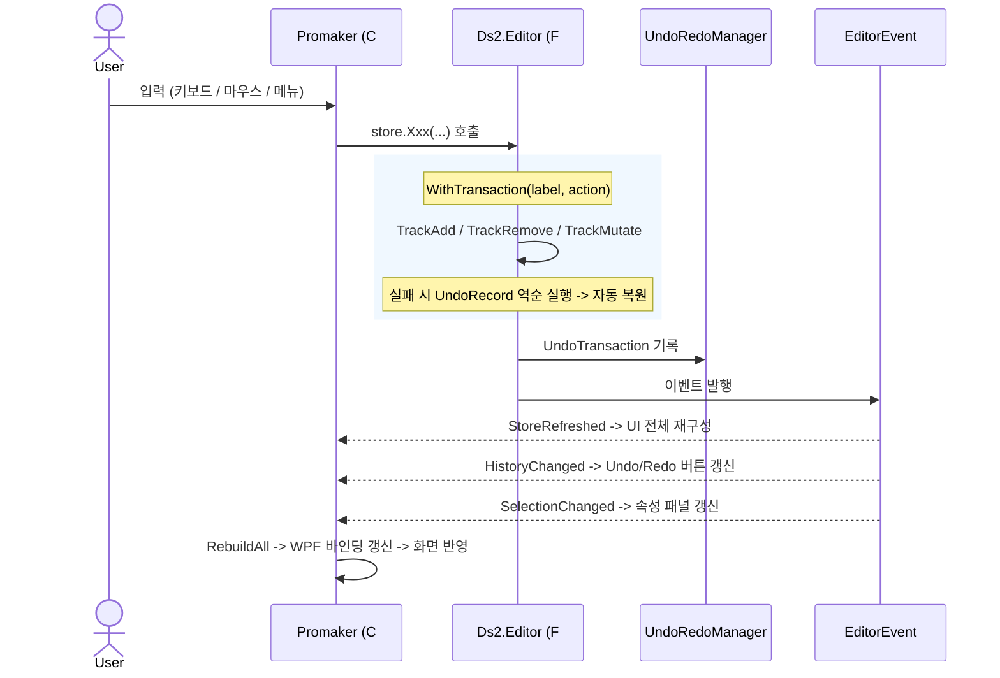
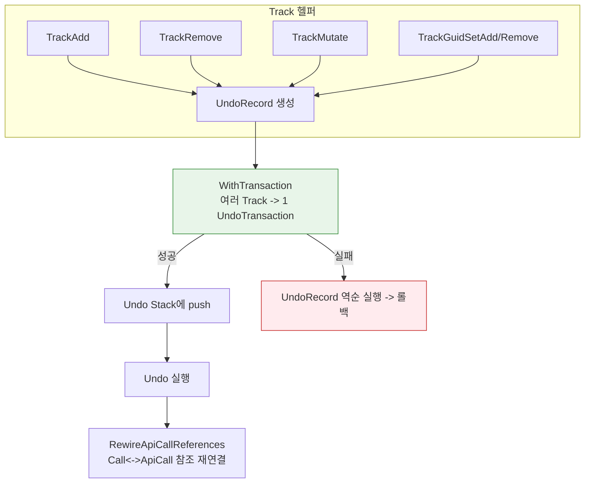
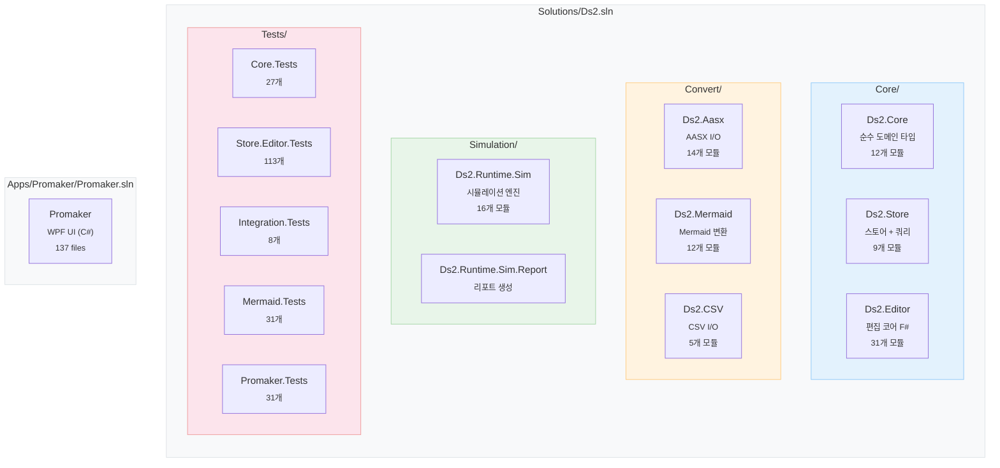

<div align="center">

# DS2 Sequence Control Editor


[](https://dotnet.microsoft.com/)
[](https://fsharp.org/)
[](https://learn.microsoft.com/dotnet/csharp/)
[](LICENSE)
[](#빌드-및-테스트)

---

[Architecture](#아키텍처) · [Entities](#엔티티-관계도) · [Build](#빌드-및-테스트) · [Runtime Docs](RUNTIME.md)

</div>

> **Last Sync:** 2026-03-24 — Ds2.Store/Editor 분리, 시뮬레이션 Critical Path + Token Unreachable 경고, TokenSpec, Report 모듈

## 핵심 설계 원칙



---

## 아키텍처

### 전체 구조



### 레이어 의존 방향



> - 상위 레이어는 하위 레이어만 의존합니다
> - `Ds2.Editor/Store → Ds2.Aasx` 순환 의존은 없습니다
> - C#용 공유 타입(`EntityKind`, `TabKind` 등)은 `Ds2.Editor/Core/EditorTypes.fs`에서 정의
> - 스토어 타입(`DsStore`, `DsQuery`)은 `Ds2.Store`에서 정의

---

## 엔티티 관계도



### 엔티티 설명

| 구분 | 설명 |
|:-----|:-----|
| **Active System** | 제어 흐름 트리 — `Flow -> Work -> Call` |
| **Passive System** | 장치 정의 트리 — `ApiDef`, HW 컴포넌트 |
| **ArrowBetweenWorks** | DsSystem의 자식, Work<->Work 연결선 (`parentId = systemId`) |
| **ArrowBetweenCalls** | Work의 자식, Call<->Call 연결선 (`parentId = workId`) |
| **Call.Name** | `DevicesAlias + "." + ApiName` (computed, Rename 시 DevicesAlias만 변경) |
| **ApiCall** | ApiDef 실행 1건 (OutTag/InTag 주소, OutputSpec/InputSpec 포함) |
| **CallCondition** | Call 동작 조건 (Active/Auto/Common 타입, IsOR, IsRising, 조건 ApiCall 목록) |

---

## 편집 흐름

하나의 편집 동작이 시스템을 통과하는 전체 경로:



### 증분 Undo/Redo 설계



> **제약**: `store.GetProject(id).Name <- "new"` 같은 직접 필드 수정은 Undo 추적 불가. 변경은 반드시 `store.메서드()` 경유
>
> 상세 내용: [`RUNTIME.md`](RUNTIME.md)

---

## 솔루션 구조



테스트 합계: **194개** (20 Core + 120 Store.Editor + 8 Integration + 28 Mermaid + 18 Promaker)

---

## 파일 구조 및 역할

<details>
<summary><b>루트 문서</b></summary>

| 파일 | 역할 |
|------|------|
| `README.md` | 프로젝트 개요, 구조, 파일 역할 인수인계 문서 |
| `RUNTIME.md` | CRUD / Undo/Redo / JSON 직렬화 / 시뮬레이션 동작 상세 |
| `.editorconfig` | 코드 스타일/포맷 기본 규칙 |

</details>

<details>
<summary><b>Ds2.Core — 순수 도메인 타입</b> (Store/Query/Mutation 없음)</summary>

| 파일 | 역할 |
|------|------|
| `AbstractClass.fs` | `DsEntity` 추상 베이스 타입, `DeepCopyHelper` |
| `Entities.fs` | Project / DsSystem / Flow / Work / Call / ApiDef / ApiCall / HW 엔티티 정의 |
| `Properties.fs` | WorkProperties / CallProperties / ApiDefProperties 등 속성 모델 |
| `Enum.fs` | `Status4`, `CallType`, `ArrowType`, `CallConditionType`, `TokenRole` 도메인 열거형 |
| `Class.fs` | `IOTag`, `Xywh` 등 값 타입 클래스 |
| `ValueSpec.fs` | `ValueSpec` DU (None / Bool / Int / Float / String / Range 등) |
| `TokenTypes.fs` | `TokenValue`, `TokenRole`, `TokenSpec` 토큰 관련 타입 |
| `Nameplate.fs` | AASX Nameplate Submodel 데이터 타입 |
| `HandoverDocumentation.fs` | AASX HandoverDocumentation Submodel 데이터 타입 |
| `JsonOptions.fs` | `System.Text.Json` 직렬화 프로필 (ProjectSerialization / DeepCopy) |
| `JsonConverter.fs` | JSON 직렬화 옵션 및 커스텀 컨버터 |

</details>

<details>
<summary><b>Ds2.Store — 스토어 + 쿼리 (F#)</b></summary>

| 파일 | 역할 |
|------|------|
| `Core/Types.fs` | `UndoRecord`/`UndoTransaction`, `Labels`, `EditorEvent` DU 기초 타입 |
| `Store/DsStore.fs` | `DsStore` 타입 — 13개 Dictionary + File I/O |
| `Core/DsQuery.fs` | 엔티티 조회 쿼리 (`getXxx`, `allXxxs`, `xxxsOf`, `tryGetDeviceDurationMs`) |
| `Store/ImportPlan.fs` | Mermaid/CSV 임포트 계획 타입 |
| `Store/ImportPlan.Device.fs` | 디바이스 임포트 계획 |
| `Queries/CallConditionQueries.fs` | CallCondition 조회 쿼리 |
| `Store/StoreHierarchyQueries.fs` | 계층 역탐색 쿼리 |
| `Compat/LegacyJsonImport.fs` | 구버전 JSON 호환 임포트 |

</details>

<details>
<summary><b>Ds2.Editor — 편집 코어 (F#)</b> — 컴파일 순서 = 의존 순서</summary>

| # | 파일 | 역할 |
|:---:|------|------|
| 1 | `Core/EditorTypes.fs` | `EntityKind`, `TabKind`, 편집 전용 타입 |
| 2 | `Commands/UndoRedoManager.fs` | `LinkedList<UndoTransaction>` 기반 undo/redo 스택 관리 |
| 3 | `Projection/ViewTypes.fs` | `TreeNodeInfo` / `CanvasNodeInfo` / `SelectionKey` |
| 4 | `Editor/StoreEditorState.fs` | Undo/Redo + 이벤트 + WithTransaction |
| 5 | `Editor/Authoring.fs` | 편집 의미론 |
| 6 | `Geometry/ArrowPathCalculator.fs` | 화살표 polyline 경로 계산 (직교 꺾임) |
| 7 | `Projection/PropertyPanelValueSpec.fs` | ValueSpec 포맷/파싱 |
| 8 | `Projection/TreeProjection.fs` | Store -> 트리 데이터 변환 |
| 9-12 | `Projection/CanvasLayout/*.fs` | 자동 배치 (Layering -> Placement -> Entry) |
| 13 | `Projection/CanvasProjection.fs` | Store -> 캔버스 콘텐츠 변환 |
| 14 | `Editor/EntityTabQueries.fs` | 탭 정보 해석 |
| 15 | `Queries/AddTargetQueries.fs` | Add System/Flow 대상 해석 |
| 16 | `Queries/EntityKindRules.fs` | 엔티티 종류별 규칙 |
| 17 | `Queries/SelectionQueries.fs` | 선택 정렬/범위/Ctrl+Shift |
| 18 | `Queries/ConnectionQueries.fs` | 화살표 연결 대상 해석, 순서 연결 |
| | **Store/ — `[<Extension>]` C# 확장 메서드** | |
| 19 | `Store/Log.fs` | 공유 로깅 + require 헬퍼 |
| 20-22 | `Store/Paste/Paste*.fs` | 붙여넣기 — ApiCall별 Device System 독립 매핑 |
| 23 | `Store/Nodes/Remove.fs` | 캐스케이드 삭제 |
| 24 | `Store/Nodes/Device.fs` | 디바이스/HW CRUD + ApiCall 복제 |
| 25 | `Store/Nodes/Nodes.fs` | CRUD/이동/삭제 — `AddCallWithMultipleDevicesResolved` |
| 26 | `Store/Arrows.fs` | 화살표 — RemoveArrows, ReconnectArrow |
| 27-28 | `Store/Panel/Panel.fs`, `Api.fs` | 속성 패널 — Time/Conditions/ApiDef CRUD |
| 29 | `Store/Panel/Batch.fs` | Duration/IO 일괄 편집 |
| 30 | `Editor/ImportPlanApply.fs` | 임포트 계획 실행 |

</details>

<details>
<summary><b>Ds2.Aasx — AASX I/O (F#)</b></summary>

| 파일 | 역할 |
|------|------|
| `AasxSemantics.fs` | idShort 상수 + Nameplate/Documentation 상수 |
| `AasxFileIO.fs` | AASX ZIP 읽기/쓰기 |
| `Import/Core.fs` | 임포트 공통 헬퍼 |
| `Import/Graph.fs` | SMC/SML -> 엔티티 재구성 |
| `Import/Metadata.fs` | Nameplate/Documentation 임포트 |
| `Import/Entry.fs` | `importFromAasxFile` 진입점 |
| `Export/Core.fs` | 익스포트 공통 헬퍼 |
| `Export/Graph.fs` | DsStore -> SMC/SML 직렬화 |
| `Export/Metadata.fs` | Nameplate/Documentation 익스포트 |
| `Export/Entry.fs` | `exportFromStore` 진입점 |
| `Concepts/Builder.fs` | ConceptDescription 빌더 |
| `Concepts/Catalog.fs` | 41개 IRDI 카탈로그 |

</details>

<details>
<summary><b>Ds2.Runtime.Sim — 시뮬레이션 엔진 (F#)</b></summary>

| 파일 | 역할 |
|------|------|
| `Model/SimState.fs` | 시뮬레이션 상태 모델 |
| `Model/StateCache.fs` | 상태 캐시 |
| `Engine/Scheduler/ScheduledEvent.fs` | 스케줄 이벤트 DU |
| `Engine/Scheduler/EventScheduler.fs` | 시간 기반 이벤트 스케줄러 |
| `Engine/Core/SimIndex.GroupExpansion.fs` | Union-Find 그룹 확장 |
| `Engine/Core/SimIndex.TokenGraph.fs` | DFS 토큰 경로 + 사이클 검출 |
| `Engine/Core/SimIndex.fs` | `SimIndex.build(store)` — 시뮬레이션 인덱스 빌드 |
| `Engine/Core/WorkConditionChecker.fs` | Work 시작/완료 조건 평가 |
| `Engine/Core/StateManager.fs` | Work/Call 상태 + 토큰 관리 |
| `Engine/Core/GraphValidator.fs` | 그래프 사전 검증 (데드락/Ignore/Source 후보) |
| `Engine/ISimulationEngine.fs` | `ISimulationEngine` 인터페이스 |
| `Engine/EventDriven/TokenFlow.fs` | 토큰 Shift/Block/Complete |
| `Engine/EventDriven/WorkTransitions.fs` | Work 상태 전이 + Duration 스케줄 |
| `Engine/EventDriven/ConditionEvaluation.fs` | 6단계 조건 평가 |
| `Engine/EventDriven/EngineRuntime.fs` | 이벤트 루프 + processEvent |
| `Engine/EventDrivenEngine.fs` | 엔진 오케스트레이션 (Context 조립) |

</details>

<details>
<summary><b>Promaker — WPF UI (C#)</b></summary>

#### ViewModels/Shell/

| 파일 | 역할 |
|------|------|
| `MainViewModel.cs` | 핵심 필드/컬렉션, NewProject/Undo/Redo, Reset, UpdateTitle |
| `EditorGuards.cs` | DsStore 확장 메서드 호출 공통 예외 처리 가드 |
| `EventHandling.cs` | `WireEvents` + `HandleEvent` + `ApplyEntityRename` |
| `FileCommands.cs` | JSON/AASX/Mermaid Open/Save |
| `SaveOutcomeFlow.cs` | Mermaid/AASX 저장 결과 처리 |
| `MermaidImportCommands.cs` | Mermaid 다이어그램 가져오기 |
| `CsvCommands.cs` | CSV 가져오기/내보내기 |
| `DurationBatchCommands.cs` | Duration 일괄 설정 |
| `IoBatchCommands.cs` | I/O 태그 일괄 설정 |
| `TokenSpecCommands.cs` | TokenSpec 관리 |
| `ToolbarState.cs` | 툴바 상태 관리 |
| `DiscardChangesFlow.cs` | 미저장 변경사항 확인/폐기 흐름 |

#### ViewModels/PropertyPanel/

| 파일 | 역할 |
|------|------|
| `PropertyPanelState.cs` | 속성 패널 공용 Collections/Properties |
| `PropertyPanelItems.cs` | 보조 뷰모델 타입 (`CallApiCallItem`, `CallConditionItem` 등) |
| `CallPanel.cs` | Call 속성 패널 — ApplyCallTimeout, RefreshCallPanel |
| `CallPanel.ApiCalls.cs` | ApiCall CRUD 메서드 |
| `CallPanel.Conditions.cs` | CallCondition CRUD, ReloadConditions |
| `SystemPanel.cs` | System 속성 패널 — ApiDef CRUD |

#### ViewModels/Simulation/

| 파일 | 역할 |
|------|------|
| `SimulationPanelState.cs` | 시뮬레이션 패널 상태 + 경고 수집 |
| `SimulationPanelState.Canvas.cs` | 시뮬레이션 캔버스 렌더링 |
| `SimulationPanelState.Events.cs` | 시뮬레이션 이벤트 처리 |
| `SimulationPanelState.ForceWork.cs` | 수동 Work 시작/리셋 |
| `SimulationPanelState.Token.cs` | 토큰 관리 |
| `SimulationPanelState.Report.cs` | 리포트 생성 |
| `GanttChartState.cs` | Gantt 차트 뷰모델 상태 |

#### ViewModels/ (기타)

| 파일 | 역할 |
|------|------|
| `EntityNode.cs` | 트리/캔버스 공용 엔티티 뷰모델 |
| `ArrowNode.cs` | 화살표 뷰모델 |
| `CanvasTab.cs` | 캔버스 탭 뷰모델 |
| `CanvasWorkspaceState.cs` | 캔버스 워크스페이스 상태 |
| `SplitCanvasManager.cs` | 분할 캔버스 관리 |
| `SelectionState.cs` | 선택 상태 관리 |
| `NodeCommands.cs` | Add/Delete/Copy/Paste |
| `NodeCreationViewModel.cs` | 노드 생성 뷰모델 |
| `EditCommandsViewModel.cs` | 편집 명령 뷰모델 |
| `FileCommandsViewModel.cs` | 파일 명령 뷰모델 |
| `TreeNodeSearch.cs` | 트리 노드 검색 |

#### Controls/

| 파일 | 역할 |
|------|------|
| `Canvas/EditorCanvas.xaml(.cs)` | 캔버스 UI + AddWork/AddCall 클릭 |
| `Canvas/EditorCanvas.Input.cs` | 마우스/키보드 입력 (드래그, Delete, 연결) |
| `Canvas/EditorCanvas.Selection.cs` | 박스 선택, 화살표 선택 |
| `Canvas/EditorCanvas.Navigation.cs` | 줌/패닝, FitToView |
| `Canvas/EditorCanvas.Connect.cs` | 화살표 연결 시작/완료/취소 |
| `Canvas/CanvasWorkspace.xaml(.cs)` | 캔버스 워크스페이스 컨테이너 |
| `Canvas/SplitCanvasContainer.xaml(.cs)` | 분할 캔버스 컨테이너 |
| `PropertyPanel/PropertyPanel.xaml(.cs)` | 속성 패널 루트 UserControl |
| `PropertyPanel/ConditionSectionControl.xaml(.cs)` | CallCondition 섹션 공통 UserControl |
| `PropertyPanel/ValueSpecEditorControl.xaml(.cs)` | ValueSpec 인라인 편집 컨트롤 |
| `PropertyPanel/ApiCallsGridControl.xaml(.cs)` | ApiCall 그리드 컨트롤 |
| `Shell/ExplorerPane.xaml(.cs)` | 좌측 탐색기 패널 (트리 뷰) |
| `Shell/HistoryPanel.xaml(.cs)` | History 패널 |
| `Shell/MainToolbar.xaml(.cs)` | 상단 툴바 (루트) |
| `Shell/MainToolbarProjectEditContent.xaml(.cs)` | 프로젝트 편집 툴바 |
| `Shell/MainToolbarSimulationContent.xaml(.cs)` | 시뮬레이션 툴바 |
| `Shell/MainToolbarToolsContent.xaml(.cs)` | 도구 툴바 |
| `Simulation/SimulationPanel.xaml(.cs)` | 시뮬레이션 패널 |
| `Simulation/SimulationControlPanel.xaml(.cs)` | 시뮬레이션 제어 패널 |
| `Simulation/GanttChartControl.xaml(.cs)` | Gantt 차트 컨트롤 |
| `Simulation/GanttChartControl.Rendering.cs` | Gantt 렌더링 |
| `Simulation/GanttChartControl.Navigation.cs` | Gantt 줌/패닝 |
| `Simulation/GanttChartControl.Tooltip.cs` | Gantt 툴팁 |

#### Dialogs/

| 파일 | 역할 |
|------|------|
| `CallCreateDialog.xaml(.cs)` | Call 생성 — CallReplication/ApiCallReplication/ApiDefPicker 모드 |
| `ApiCallCreateDialog.xaml(.cs)` | ApiCall 생성 |
| `ApiCallSpecDialog.xaml(.cs)` | ApiCall InTag/OutTag/ValueSpec 편집 |
| `ApiDefEditDialog.xaml(.cs)` | ApiDef 속성 편집 |
| `ArrowTypeDialog.xaml(.cs)` | 화살표 유형 선택 (Start/Reset/StartReset/Group) |
| `ConditionDropDialog.xaml(.cs)` | 조건 드래그&드롭 다이얼로그 |
| `ConditionApiCallPickerDialog` | (ConditionDropDialog에 통합) |
| `CsvExportDialog.xaml(.cs)` | CSV 내보내기 옵션 |
| `CsvImportDialog.xaml(.cs)` | CSV 불러오기 (미리보기 + 매핑) |
| `MermaidImportDialog.xaml(.cs)` | Mermaid 텍스트 가져오기 |
| `ProjectPropertiesDialog.xaml(.cs)` | 프로젝트 속성 편집 |
| `TokenSpecDialog.xaml(.cs)` | TokenSpec 편집 |
| `DurationBatchDialog.xaml(.cs)` | Duration 일괄 설정 |
| `IoBatchSettingsDialog.xaml(.cs)` | I/O 태그 일괄 설정 |
| `ValueSpecDialog.xaml(.cs)` | ValueSpec 독립 편집 |
| `DialogHelpers.cs` | 공통 다이얼로그 헬퍼 |
| `BatchDialogHelper.cs` | 일괄편집 다이얼로그 헬퍼 |

</details>

<details>
<summary><b>테스트 프로젝트</b></summary>

| 프로젝트 | 역할 | 테스트 수 |
|---------|------|:--------:|
| `Ds2.Core.Tests` | Core 엔티티/DeepCopy/ValueSpec/JSON 단위 테스트 | 20 |
| `Ds2.Store.Editor.Tests` | DsStore CRUD/Undo/Redo/캐스케이드/복사붙여넣기/패널/Projection/조건 테스트 | 120 |
| `Ds2.Integration.Tests` | 통합 시나리오 테스트 | 8 |
| `Ds2.Mermaid.Tests` | Mermaid 파서/매퍼/Undo 검증 | 28 |
| `Promaker.Tests` | Promaker ViewModel/시뮬레이션 테스트 | 18 |

</details>

---

## 로깅 (log4net)

log4net 2.0.17이 F#+C# 전 레이어에 적용되어 있습니다.

<details>
<summary><b>로깅 설정 상세</b></summary>

### 초기화

`App.xaml.cs OnStartup`에서 `XmlConfigurator.Configure(new FileInfo("log4net.config"))`로 초기화합니다.
log4net.config 파일이 없으면 로깅 없이 앱이 정상 실행됩니다.

### 로그 파일 위치

```
<실행 파일 위치>/logs/ds2_yyyyMMdd.log
```

- Composite 롤링 (날짜 + 크기): 최대 10MB x 10개 백업 보관
- Visual Studio 출력 창(DebugAppender)에도 동시 출력

### 로거별 레벨 전략

| 지점 | 레벨 | 예시 |
|------|:----:|------|
| 앱 시작/종료 | `INFO` | `=== Promaker startup ===` |
| 전역 미처리 예외 | `FATAL` | `DispatcherUnhandledException` + 스택 트레이스 |
| EditorEvent 구독자 에러 | `ERROR` | `EditorEvent 구독자 에러` + 예외 |
| JSON 파일 열기/저장 성공 | `INFO` | `파일 열기/저장 완료: {path}` |
| JSON 파일 열기/저장 실패 | `ERROR` | 예외 포함 |
| AASX import/export 성공 | `INFO` | 경로 포함 |
| AASX import 빈 결과 | `WARN` | |
| `WithTransaction` 성공 | `DEBUG` | `Executed: {label}` |
| `WithTransaction` 실패 | `ERROR` | `Transaction failed: {label}` + 예외 |
| Undo/Redo 성공 | `DEBUG` | `Undo: {명령 레이블}` |
| Undo/Redo 실패 | `ERROR` | 예외 포함 |

### 패키지 적용 범위

| 프로젝트 | 로거 선언 방식 |
|---------|-------------|
| `Ds2.Store` (F#) | `LogManager.GetLogger(typedefof<DsStore>)` |
| `Ds2.Editor` (F#) | `LogManager.GetLogger("Ds2.Editor.StoreLog")` |
| `Ds2.Aasx` (F#) | `LogManager.GetLogger("Ds2.Aasx.AasxFileIO")` |
| `Promaker` (C#) | `LogManager.GetLogger(typeof(App))` / `typeof(MainViewModel)` |

</details>

---

## 빌드 및 테스트

```bash
# 빌드
dotnet build Solutions/Ds2.sln -nologo
dotnet build Apps/Promaker/Promaker.sln -nologo

# 테스트
dotnet test Solutions/Ds2.sln -nologo
```

---

## 관련 문서

| 문서 | 내용 |
|:-----|:-----|
| [`RUNTIME.md`](RUNTIME.md) | CRUD / Undo/Redo / JSON 직렬화 / 복사붙여넣기 / 캐스케이드 삭제 / 시뮬레이션 동작 상세 |

---

## License and Notices

| | |
|:--|:--|
| **License** | Apache License 2.0 — see [`LICENSE`](LICENSE) |
| **Notice** | Project notices and attribution — see [`NOTICE`](NOTICE) |
| **Patents** | See [`PATENTS.md`](PATENTS.md) and [dualsoft.co.kr/HelpDS/patents](http://dualsoft.co.kr/HelpDS/patents/patents.html) |
| **Commercial** | Enterprise support — see [`COMMERCIAL.md`](COMMERCIAL.md) |
