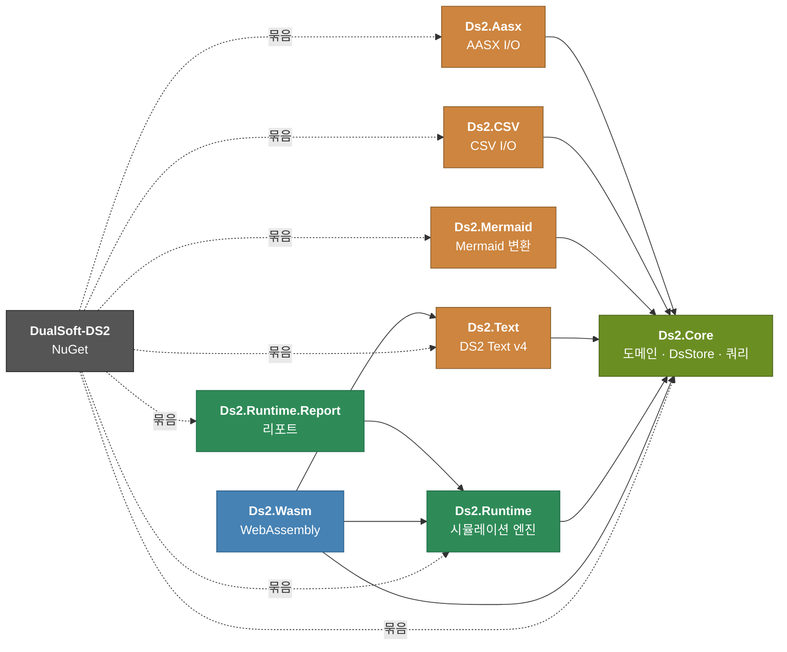
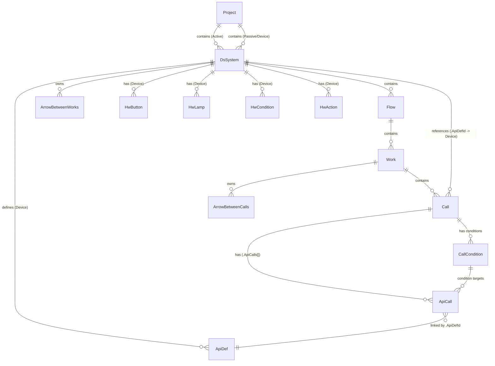

<div align="center">

# DS2 — 설비 시퀀스 모델 라이브러리

[](https://dotnet.microsoft.com/)
[](https://fsharp.org/)
[](https://www.nuget.org/packages/DualSoft-DS2)
[](LICENSE)
[](#빌드-및-테스트)

---

[구성](#저장소-구성) · [엔티티](#엔티티-관계도) · [빌드](#빌드-및-테스트) · [NuGet](#nuget-패키지) · [소비 저장소](#이-라이브러리를-쓰는-저장소)

</div>

> **2026-10-10** — 편집기·백엔드·앱을 별도 저장소로 분리했다. 이 저장소는 **라이브러리만** 담는다.
> 분리 직전 커밋은 태그 `monorepo-last` 이며, 그 이전 이력에는 앱 코드가 함께 들어 있다.

## 무엇인가

DS2 는 설비 시퀀스 제어 모델을 다루는 .NET 9 / F# 라이브러리 모음이다.

- **도메인 모델과 스토어** — `Project → DsSystem → Flow → Work → Call` 계층, 장치(`ApiDef`/`ApiCall`), 조건, 토큰, 표준 서브모델(AID·Nameplate 등), KPI
- **변환기** — Mermaid / CSV / AASX(Asset Administration Shell) / DS2 Text v4 로 읽고 쓴다
- **시뮬레이션 런타임** — 이벤트 구동 토큰 시뮬레이션 엔진과 HTML/CSV 리포트

편집기(Promaker)와 AASX 편집기는 각자 저장소에서 이 저장소를 `external/ds2` 서브모듈로 가져다 쓴다.

---

## 저장소 구성

```
Solutions/
  Core/Ds2.Core             도메인 엔티티 · DsStore · 쿼리 · 표준 서브모델 · KPI · JSON 직렬화
  Convert/Ds2.Aasx          AASX import/export (AasCore.Aas3_1)
  Convert/Ds2.CSV           CSV import/export
  Convert/Ds2.Mermaid       Mermaid 다이어그램 import/export
  Convert/Ds2.Text          DS2 Text v4 writer
  Runtime/Ds2.Runtime       이벤트 구동 시뮬레이션 엔진
  Runtime/Ds2.Runtime.Report  시뮬레이션 리포트(HTML/CSV)
  Pack/DualSoft-DS2         위 라이브러리를 한 패키지로 묶는 NuGet 프로젝트
  Wasm/Ds2.Wasm             브라우저용 WebAssembly 빌드(Core + Text + Runtime)
  Tests/                    Core · Aasx · CSV · Mermaid · Runtime 테스트 + Ds2.TestKit(모델 빌더)
  Ds2.sln                   전체 솔루션
Apps/Tutorial/              C# 소스 레벨 튜토리얼(Ds2.Tutorial)
scripts/                    AASX 변환·검증 F# 스크립트
```

### 의존 방향


```mermaid
graph LR
  CORE["<b>Ds2.Core</b><br/>도메인 · DsStore · 쿼리"]
  AASX["<b>Ds2.Aasx</b><br/>AASX I/O"]
  CSV["<b>Ds2.CSV</b><br/>CSV I/O"]
  MER["<b>Ds2.Mermaid</b><br/>Mermaid 변환"]
  TXT["<b>Ds2.Text</b><br/>DS2 Text v4"]
  RT["<b>Ds2.Runtime</b><br/>시뮬레이션 엔진"]
  RPT["<b>Ds2.Runtime.Report</b><br/>리포트"]
  WASM["<b>Ds2.Wasm</b><br/>WebAssembly"]
  PACK["<b>DualSoft-DS2</b><br/>NuGet"]

  AASX --> CORE
  CSV --> CORE
  MER --> CORE
  TXT --> CORE
  RT --> CORE
  RPT --> RT
  WASM --> CORE
  WASM --> TXT
  WASM --> RT
  PACK -.묶음.-> CORE
  PACK -.묶음.-> AASX
  PACK -.묶음.-> CSV
  PACK -.묶음.-> MER
  PACK -.묶음.-> TXT
  PACK -.묶음.-> RT
  PACK -.묶음.-> RPT

  style CORE fill:#6b8e23,color:#fff,stroke:#4a6319
  style AASX fill:#cd853f,color:#fff,stroke:#8b5e2b
  style CSV fill:#cd853f,color:#fff,stroke:#8b5e2b
  style MER fill:#cd853f,color:#fff,stroke:#8b5e2b
  style TXT fill:#cd853f,color:#fff,stroke:#8b5e2b
  style RT fill:#2e8b57,color:#fff,stroke:#1e6b47
  style RPT fill:#2e8b57,color:#fff,stroke:#1e6b47
  style WASM fill:#4682b4,color:#fff,stroke:#2c5f8a
  style PACK fill:#555,color:#fff,stroke:#222
```

- 모든 라이브러리는 `Ds2.Core` 만 아래로 본다. 변환기끼리, 런타임과 변환기 사이에는 의존이 없다.
- 상태 변경은 `DsStore` 의 메서드를 거친다. 편집 의미(Undo/Redo·복사/붙여넣기)는 이 저장소가 아니라 편집기 저장소의 `Ds2.Editor` 가 담당한다.

---

## 엔티티 관계도


```mermaid
erDiagram
    Project ||--o{ DsSystem : "contains (Active)"
    Project ||--o{ DsSystem : "contains (Passive/Device)"

    DsSystem ||--o{ Flow : contains
    DsSystem ||--o{ ArrowBetweenWorks : owns
    DsSystem ||--o{ ApiDef : "defines (Device)"
    DsSystem ||--o{ HwButton : "has (Device)"
    DsSystem ||--o{ HwLamp : "has (Device)"
    DsSystem ||--o{ HwCondition : "has (Device)"
    DsSystem ||--o{ HwAction : "has (Device)"

    Flow ||--o{ Work : contains

    Work ||--o{ Call : contains
    Work ||--o{ ArrowBetweenCalls : owns

    Call ||--o{ ApiCall : "has (.ApiCalls[])"
    Call ||--o{ CallCondition : "has conditions"
    Call }o--|| DsSystem : "references (.ApiDefId -> Device)"

    ApiCall }o--|| ApiDef : "linked by .ApiDefId"

    CallCondition ||--o{ ApiCall : "condition targets"
```

| 구분 | 설명 |
|:-----|:-----|
| **Active System** | 제어 흐름 트리 — `Flow → Work → Call` |
| **Passive System** | 장치 정의 트리 — `ApiDef`, HW 컴포넌트 |
| **ArrowBetweenWorks** | DsSystem 의 자식, Work↔Work 연결선 (`parentId = systemId`) |
| **ArrowBetweenCalls** | Work 의 자식, Call↔Call 연결선 (`parentId = workId`) |
| **ApiCall** | ApiDef 실행 1건 (OutTag/InTag 주소, OutputSpec/InputSpec) |
| **CallCondition** | Call 동작 조건 (Active/Auto/Common, IsOR, IsRising, 조건 ApiCall 목록) |

---

## 빌드 및 테스트

```bash
dotnet build Solutions/Ds2.sln -nologo
dotnet test  Solutions/Ds2.sln -nologo
```

| 테스트 프로젝트 | 범위 | 수 |
|:--|:--|--:|
| `Ds2.Core.Tests` | 엔티티 · DsStore · 쿼리 · 표준 서브모델 · JSON | 141 |
| `Ds2.Runtime.Tests` | 시뮬레이션 엔진 · abnormal 정책 · 리포트 | 122 |
| `Ds2.Aasx.Tests` | AASX 라운드트립 · AID | 63 |
| `Ds2.CSV.Tests` | CSV import/export · AI 용 CSV | 54 |
| `Ds2.Mermaid.Tests` | Mermaid 파서/매퍼 | 5 |

`Ds2.TestKit` 은 편집기 없이 모델을 만드는 테스트용 빌더(`ModelBuilder`)다. 다른 저장소의 테스트도 가져다 쓴다.

### 튜토리얼

```bash
dotnet run --project Apps/Tutorial/Ds2.Tutorial.csproj
```

모델 생성 → 변환 → 시뮬레이션 → 리포트까지 8단계. 자세한 내용은 [`Apps/Tutorial/README.md`](Apps/Tutorial/README.md).

---

## NuGet 패키지

```bash
dotnet add package DualSoft-DS2
```

`Ds2.Core` · `Ds2.Aasx` · `Ds2.CSV` · `Ds2.Mermaid` · `Ds2.Text` · `Ds2.Runtime` · `Ds2.Runtime.Report` 를 한 패키지로 담는다. 만드는 법과 소비자용 예제는 [`Solutions/Pack/Readme.md`](Solutions/Pack/Readme.md).

```bash
dotnet pack Solutions/Pack/DualSoft-DS2.csproj -c Release -p:Version=0.1.24
```

---

## 이 라이브러리를 쓰는 저장소

| 저장소 | 역할 | 서브모듈 |
|:--|:--|:--|
| [`ds2-Promaker`](https://github.com/DualsoftDev/ds2-Promaker) | 시퀀스 모델 편집기 + 시뮬레이션 (WPF) — `Ds2.Editor`, `Ds2.IOList`, `Ds2.View3D` 포함 | `external/ds2` |
| [`ds2-AasxEditor`](https://github.com/DualsoftDev/ds2-AasxEditor) | AASX JSON 편집기 (Blazor) | `external/ds2` |

소비 저장소는 이 저장소의 프로젝트를 `external/ds2/Solutions/...` 경로로 직접 참조한다. 받을 때는 서브모듈까지 함께 받는다.

```bash
git clone --recurse-submodules https://github.com/DualsoftDev/ds2-Promaker.git
```

---

## 관련 문서

| 문서 | 내용 |
|:-----|:-----|
| [`Apps/Tutorial/README.md`](Apps/Tutorial/README.md) | C# 튜토리얼 단계 설명 |
| [`Solutions/Pack/Readme.md`](Solutions/Pack/Readme.md) | NuGet 패키지 구성·배포 |

---

## License and Notices

이 저장소는 **Apache License 2.0** 이다.

| | |
|:--|:--|
| **License** | Apache License 2.0 — [`LICENSE`](LICENSE) |
| **Notice** | 고지·저작자 표시 — [`NOTICE`](NOTICE) |
| **Patents** | [`PATENTS.md`](PATENTS.md) · [dualsoft.co.kr/HelpDS/patents](http://dualsoft.co.kr/HelpDS/patents/patents.html) |
| **Commercial** | 기업 지원 — [`COMMERCIAL.md`](COMMERCIAL.md) |
